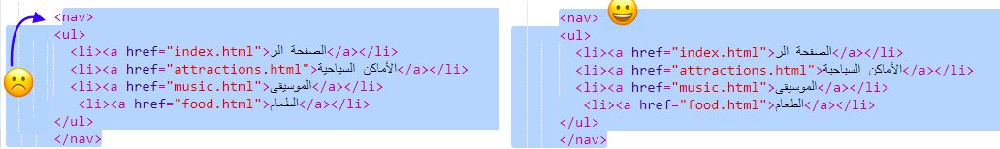

## التنقل في موقعك الإلكتروني

تحتوي العديد من المواقع على قائمة **التنقل** لمساعدة الزوار على التنقل بين الصفحات. الآن وبعد أن حصلت على مجموعة من الصفحات وصفحة رئيسية وروابط لكل صفحة ، دعنا ننقل قائمة الروابط إلى قسم التنقل في أعلى كل صفحة.


- ابحث عن الكود الخاص بقائمة الروابط التي قمت بإنشائها في الخطوة السابقة.

- مباشرة قبل رمز الفتح `<ul>`، اضغط زر **Enter** لإنشاء سطر فارغ جديد، ثم اكتب في السطر الجديد الرمز التالي: `<nav>`. سيقوم Trinket بإضافة رمز الإغلاق مباشرة بعده، ولكن يمكنك إزالته - هذا ليس مكانه المناسب.

- مباشرة **بعد** رمز الإغلاق`</ul>`، اضغط زر **Enter** لإنشاء سطر فارغ جديد، ثم اكتب رمز الإغلاق `</nav>` هناك.

- الأن حدد جزء `<nav>` والقائمة بالكامل بالنقر مباشرة قبل رمز الفتح `<nav>` وسحب فأرة التحكم (الماوس) وصولًا إلى ما بعد رمز الإغلاق `</nav>` مباشرة، بحيث يتم تحديد كل النص بما في ذالك رموز الفتح و الإغلاق. تأكد من ان كل **الأقواس التي على شكل زاوية** `<` و`>` في البداية والنهاية محدده كذالك!



- ستقوم **بقص** بدلًا من النسخ هذه المرة. اضغط زر <kbd>Ctrl</kbd> (أو <kbd>cmd</kbd>)، وأثناء الضغط عليه، اضغط زر<kbd>X</kbd>. ستختفي البرمجة المحددة، لكن لا داعي للخوف!

- في أعلى الملف ، انقر فوق المسافة بين رمزين `<header> و</header>`. تأكد من رؤية المؤشر يومض هناك. الآن الصق الكود بالضغط على <kbd> Ctrl </kbd> (أو <kbd> cmd</kbd>) و <kbd> V </kbd> كل عادة. يجب أن يبدو الكود مشابه لهذا الشكل:

```html
    <header>
        <nav>
            <ul>
            <li><a href="index.html">الرئيسية</a></li>
            <li><a href="attractions.html">أماكن للزيارة</a></li>
            <li><a href="music.html">موسيقى</a></li>
            <li><a href="food.html">مأكولات</a></li>
            </ul>
        </nav>
    </header>
```

## \--- collapse \---

## title: تراجع!

إذا قمت بخطأ ما ، فيمكنك ** التراجع ** عن ذلك عن طريق الضغط على أزرار<kbd> Ctrl </kbd> (أو <kbd> cmd </kbd>) و <kbd> Z </kbd>معاً. يمكنك عادةً ضغط مجموعة الأزرار هذه عدة مرات للتراجع عن التغييرات القليلة السابقة. هذا اختصار مفيد آخر يمكنك استخدامه في العديد من البرامج!

\--- /collapse \---

- جرب الروابط الخاصة بك للتأكد من أنها لا تزال تعمل.

\--- challenge \---

## تحدي: قوائم التنقل لكل الصفحات

- ضع هذا الجزء من الكود في قسم الرأس لكل ملف HTML قمت بإنشائه. سيؤدي ذلك إلى ظهور قائمة التنقل في أعلى كل صفحة في موقع الويب الخاص بك.
    
    \--- hints \---
    
    \--- hint \--- حدد القسم `<nav>` بالكامل كما فعلت من قبل ، واضغط على مفاتيح <kbd> Ctrl </kbd> (أو <kbd> cmd</kbd>) و <kbd> C </kbd> معا لنسخه.

ثم، في كل من ملفات `.html`، انقر بداخل جزء `<header> </header>` ولصق الكود تماماً كما فعلت في السابق. \--- hint/ \---

\--- hints/ \---

ستتمكن الآن من النقر على الروابط بغض النظر عن الصفحة التي أنت فيها.

\--- /challenge \---