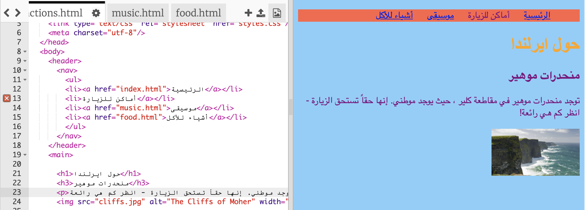

## إنشاء شريط قوائم

في هذه البطاقة سترى كيف يمكنك ان تحول قائمة التنقل الخاصة بك إلى قائمة تنقل رائعة المظهر من خلال إضافة المزيد من قواعد CSS في صفحة الأنماط.


- انتقل إلى ملف صفحة الأنماط في علامة التبويب `styles.css`. انقر **أسفل** قوس الإغلاق النتعرج `} ، واضغط على **Enter** لإنشاء سطر فارغ جديد. أضف قاعدة CSS التالية:

```css
    nav ul {
        background-color: tomato;
    }
```

لاحظ كيف أستخدمت اثنتين من المحددات بدلا من واحدة؟ إذا استخدمت محدد `ul` لوحده ، فإن القاعدة تؤثر على جميع القوائم غير المرتبة في موقع الويب الخاص بك. إضافة محدد `nav` يجعله ينطبق فقط على القوائم الموجودة بين رمز `nav`.


دعونا نتخلص من النقاط. تلك هي النقاط الموجودة أمام كل عنصر في القائمة.

- أضف النمط التالي إلى الملف `styles.css`. مرة أخرى، اكتبه في سطر جديد بعد `}  لكي لا يكون داخل أي مجموعة أخرى من القواعد.

```css
    nav ul li {
        list-style-type: none;
    }
```

لاحظ أن هذه المجموعة من القواعد بها ثلاثة محددات: وهي تحدد كل عناصر `li` الموجودة في قائمة `ul` التي هي بداخل رمز `nav`. Phew!


الآن لنجعل القائمة أفقية (جنبًا لجنب) بدلًا من رأسية (من الأعلى إلى الأسفل).

- داخل قاعدة CSS الجديدة التي أنشأتها للتو ، أضف السطر التالي: `display: inline;`.


- عناصر القائمة الآن جميعها ملتصقة ببعض، لذالك دعونا نضيف خصائص `margin-right` و`margin-left` لجعل مسافة بينهم. الآن يجب أن يبدو كود CSS كما يلي:

```css
    nav ul li {
        list-style-type: none;
        display: inline;
        margin-right: 10px;
        margin-left: 10px;
    }
```

تذكر: `10 px` يعني عشرة بكسلات.

ماذا عن جعل القائمة تتغير لتخبرك بالصفحة التي أنت فيها؟ هذا الجزء لن يكون في صفحة النماط.

- ابدأ بالصفحة الرئيسية. انتقل إلى ملف `index.html`. في قائمة الروابط، احذف رمز الرابط قبل وبعد كلمة `الرئيسية`، هكذا يكون عنصر القائمة عبارة عن مجرد نص ما بين رمزين `<li> و</li>`، هكذا: `<li>الرئيسية</li>`.

- الآن انتقل إلى كل ملف من ملفاتك الأخرى ، وقم بالشيء نفسه ، في كل مرة قوم بإزالة رموز الروابط للصفحة التي تقوم بتعديلها. لكي يكون، على سبيل المثال، في ملف `music.html`، قد ازلت رموز الروابط من عنصر القائمة `موسيقى`:

```html
    <header>
        <nav>
            <ul>
            <li><a href="index.html">الرئيسية</a></li>
            <li><a href="attractions.html">أماكن للزيارة</a></li>
            <li>موسيقى</li>
            <li><a href="food.html">مأكولات</a></li>
            </ul>
        </nav>
    </header>
```

- استكشف صفحاتك من خلال النقر على الروابط. هل ترى كيف يعرض شريط القائمة الصفحة التي أنت بها بشكل نص عادي وليس رابط؟ 



في البطاقة التالية ، ستتعلم المزيد من حيل CSS لجعل شريط القائمة يبدو أروع.