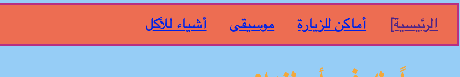

## تصميم شكل شريط القوائم

بأستخدام CSS، فإن إمكانيات جعل شريط القوائم الخاص بك يبدو رائعًا لا مثيل له.

- انتقل إلى ملف ` styles.css ` مرة أخرى - المكان الذي تحدث فيه الأشياء الرائعة!

- ابحث عن محدد ` nav ul `، وأضف المزيد من القواعد بحيث يبدو كهذا:

```css
  Nv ul {
    background-لوون: الطماط؛
    على نمط الحدود: الصلب؛
    لون الحدود: الأحمر القاني المتوسط؛
    عرض الحدود: 2px؛
    الحشد: 10px؛
}
```

خاصية `padding` تضيف مسافة. هل يمكنك معرفة عمل الخواص الأخرى؟ حاول تجربة ألوان وأرقام بكسل مختلفة.



- للتخلص من السطر أسفل الروابط ، أضف الكود التالي في سطر جديد بعد إغلاق القوس المتعرج `}` لقواعد `nav ul li`. يمكنك وضعها بعد أي `} ` ، ولكن من الأفضل الاحتفاظ بالأشياء ذات الصلة معًا حتى يسهل العثور عليها!

```css
  نقالة ل ل i {
      زخرفة النص: لا شيء؛
}
```

تنطبق القاعدة أعلاه على الروابط `<a>` داخل عناصر القائمة `<li>` في قائمة غير مرتبة `<ul>` داخل قسم التنقل `<nav>`. واو ، هذه أربعة محددات!


تذكر كيف قمت بإزالة رموز الرابط من بعض عناصر القائمة في `<nav>` لتتمكن من رؤية الصفحة التي تتصفحها بسهولة؟ لماذا لا تقوم أيضًا بتغيير لون نص عناصر قائمة التنقل والتي ليست روابط!

- ابحث عن محدد ` nav ul li `، وأضف ** داخل ** الأقواس المتعرجة السطر التالي:

```css
  اللون: البابايا ;
```

يمكنك اختيار اي لون يعجبك!

يمكنك ايضاً إضافة خاصية `color` إلى قواعد `nav ul li a` إذا كنت تريد أن تكون الروابط في القائمة بلون مختلف عن الروابط الأخرى في موقعك.

- ماذا عن بعض الزوايا الدائرية لقائمتك؟ حاول إضافة الكود التالي إلى قواعد ` nav ul ` لمعرفة ما سيحدث: `border-radius: 10px;`.

خاصية `border-radius` وسيلة سهلة جداً لجعل اي شيء يبدو لطيفاً!


\--- تحدي \---

## تحدي: اجعل صورك بزوايا منحنية

- في صفحة الأنماط الخاصة بك ، قم بإنشاء مجموعة جديدة من القواعد للصور باستخدام محدد ` img `، وإضف فيه قاعدة `border-radius`.

\--- /تحدي \---