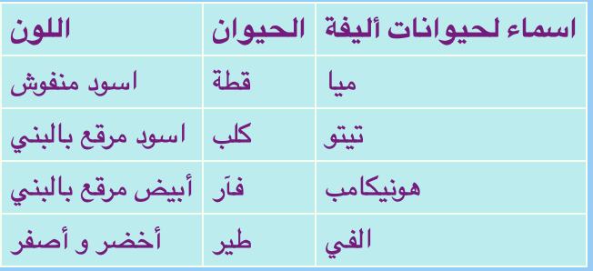

## إضافة جدول

في بعض الأحيان قد يكون من المفيد إظهار المعلومات في جدول. على سبيل المثال ، قد ترغب في إدراج معلومات الأعضاء على موقع ويب لنادي رياضي محلي أو مدرسة ، أو معلومات حول أفضل عشر أغاني لديك.

الجدول عبارة عن شبكة مكونة من **rows**صفوف و **columns** أعمدة. تتضمن معظم الجداول أيضًا عناوين أعلى كل عمود ، تسمى رأس . إليك مثالاً:



- انتقل إلى الملف `الصفحه _مع_العامود .html`. هناك سترى مجموعة من التعليمات البرمجية بين رموز `<table> </table>`.

- حدد كل الكود من رمز البداية `<table>` إلى نهاية رمز الإغلاق `</table>` وإنسخها. ثم انتقل إلى أحد ملفاتك حيث تريد وضع جدول ، والصقه في الكود.

في الوقت الحالي جدولك فارغ.

- املء الجدول الخاص بك مع أي شيء تريده! ما عليك سوى وضع النص بين رمز `<td> و</td>` وبين رمز `<th> و</th>`. يمكنك إضافة المزيد من الرموز إذا كنت في حاجة لذالك.

--- collapse ---
---
title: رمز المثال
---

تبدو برمجة HTML للجدول الموضح أعلاه كما يلي:

```html
  <table>
    <tr>
      <th>اسماء لحيوانات أليفة</th>
      <th>الحيوان</th>
      <th>اللون</th>
    </tr>
    <tr>
      <td>ميا</td>
      <td>قطة</td>
      <td>اسود منفوش</td>
    </tr>
    <tr>
      <td>تيتو</td>
      <td>كلب</td>
      <td>اسود مرقع بالبني</td>
    </tr>
    <tr>
      <td>هونيكامب</td>
      <td>فآر</td>
      <td>أبيض مرقع بالبني</td>
    </tr>
    <tr>
      <td>الفي</td>
      <td>طير</td>
      <td>أخضر و أصفر</td>
    </tr>
  </table>
```

--- /collapse ---

لإضافة صف آخر ، أضف مجموعة أخرى من رموز `<tr> </tr>`. بينهما، يمكنك وضع نفس العدد من عناصر **البيانات** بأستخدام رموز `<td> و</td>` كما في الصفوف الأخرى.

لإضافة **عمود** آخر، أضف عنصر **بيانات** جديد بأستخدام رموز `<td> و</td>` **لكل** صف. أيضاً أضف عنصر **رأس** جديد في الصف الأول، بأستخدام رموز `<th> و</th>`.

--- collapse ---
---
title: كيف يعمل؟
---

دعونا نلقي نظرة على كل هذه الرموز. يشبه إلى حد كبير رموز القائمة (تتذكر `<ul>` و `<ol>`) ولكن مع مستويات أكثر.

كل زوج من رموز `<tr> </tr>` عبارة عن صف ، لذلك سيتم عرض كل شيء بينها في سطر واحد.

يحتوي الصف الأول على رموز `<th> و</th>`. يتم استخدام هذه الرموز للرؤوس ، لذا فإن عناوين الأعمدة تكون بينهما. هناك زوج واحد لكل عمود لديك في الجدول.

ورموز `<td> </td>` تحدد ما يسمى بيانات الجدول ، وهذا ما بوجد في جميع الصفوف الأخرى. هذه تشبه رموز عنصر القائمة `<li> </li>`: كل شيء بينهما عبارة عن خانة واحدة في صف الجدول الخاص بك.

--- /collapse ---

- إذا نظرت إلى نهاية ملف `styles.css`، سترى كود CSS الذي يصف كيف يجب أن يظهر الجدول. ليس عليك أن تفهم كل ذلك! ولكن يمكنك تجربة تغيير ألوان النص والحدود والخلفية لتصميم النمط الخاص بك.

```css
  table, th, td {
    border: 1px solid HoneyDew;
    border-collapse: collapse;
  }
  tr {
    background-color: PaleTurquoise;
  }
  th, td {
    vertical-align: top;
    padding: 5px;
    text-align: left;
  }
  th {
    color: purple;
  }
  td {
    color: purple;
  }
```

لاحظ ان بعض المحددات تستخدم الفواصل، على سبيل المثال `table, th, td`؟ هذه **قائمة من المحددات**: هذا يعني انها تنطبق على كل عناصر`<th>` و كل عناصر`<td>`. يحفظ كتابة نفس مجموعة القواعد لكل محدد!