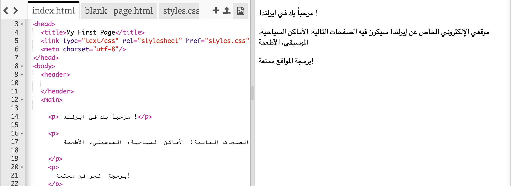

## هيا بنا لنبدأ

- أذهب إلى [ملف trinket هذا](http://dojo.soy/html-b-start). سترى مربعًا يحتوي على مثال لمشروع موقع الويب. في الجانب الأيمن يتواجد الموقع الإلكتروني، و في الجانب الأيسر تتواجد البرمجة التي تم صنع الموقع الإلكتروني منها. 

## \--- collapse \---

## title: يوجد لدي حساب في موقع Trinket

- اضغط على زر **Remix** في اعلى اليمين من صفحة المشروع. إذا لم تقم بتسجيل الدخول ، فسيُطلب منك القيام بذلك. بمجرد تسجيل الدخول ، ستحتاج إلى الضغط على زر ** Remix ** مرة أخرى. يؤدي الضغط على هذا الزر إلى إنشاء نسخة من المشروع لتعمل عليها. 

يجب أن يقول الزر** remixed ** بعد الضغط عليه:

\--- /collapse \---

## \--- collapse \---

## title: يوجد لدي حساب في موقع Trinket

يمكنك حفظ عملك باستخدام أحد الخيارات الموجودة في قائمة **مشاركة**. سوف تحصل على رابط يمكنك حفظه في مكان ما، على سبيل المثال في ملف، أو إرساله إلى شخص ما عبر البريد الإلكتروني. **ملاحظة:** في كل مرة تقوم فيها بإجراء تغيير ، ستحصل على رابط جديد.

إذا كنت تريد إنشاء حساب على Trinket ، فاتبع الخطوات التالية. سيتيح لك ذلك الوصول إلى عملك بسهولة من أي جهاز كمبيوتر، وإلى **إعادة تعديل** مشاريع قام شخص آخر بمشاركتها معك. إعادة التعديل تعني أنك ستحفظ بنسخة من المشروع حتى تتمكن من إجراء التغييرات الخاصة بك عليها.

- انتقل إلى [موقع Trinket](http://dojo.soy/trinket) وأضغط على زر **Sign Up For Your Free Account**. ستحتاج إلى عنوان بريد إلكتروني للتسجيل.

- أدخل عنوان بريدك الإلكتروني واختر كلمة مرور، أو اطلب من شخص ما القيام بذلك نيابة عنك.

- يمكنك الآن الوصول إلى جميع مشاريعك المحفوظة أو التي تمت إعادة تعديلها من خلال الضغط على اسم المستخدم الخاص بك والانتقال إلى ** My Trinkets **. 

\--- /collapse \---

لنبدأ البرمجة!