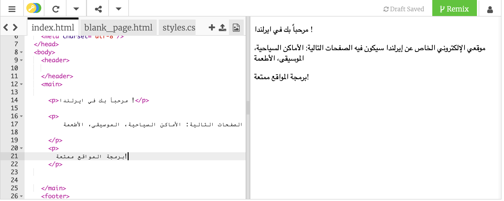
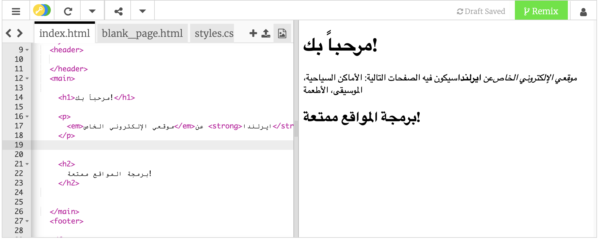

## صفحتك الإلكترونية الأولى!

- في اللوحة التي على جهة اليسار، **لوحة البرمجة**، أضغط على علامة التبويب التي تسمى `index.html`.

- ابحث عن السطر الذي يقول `مرحبًا بك في أيرلندا!` وقم بتغييره إلى رسالتك الخاصة - كن حذراً **لا** تحذف الرموز `<p>` في بداية السطر و `</p>` في نهاية السطر. يجب أن ترى تحديثاً في صفحة الويب الخاصة بك في اللوحة التي على جهة اليمين.



- الآن في نفس السطر، قم بتغيير `<p>` و `</p>` إلى `<h1>` و `</h1>`. هل تلاحظ أي تغيير في النتيجة على اليمين؟

```html
  <h1> مرحبًا بكم في أيرلندا! </h1>
```

--- collapse ---
---
title: شرح ال HTML و الترميز
---

**HTML** هي اللغة التي تصنع صفحات الويب.

ال`html.` الموجودة في اسم الملف توضح للمتصفح ان هذا الملف صفحة ويب لكي يستطيع المتصفح التعرف على **الرموز** ومعرفة ما يظهره على الشاشة. (المتصفح هو البرنامج الذي تستخدمه لمشاهدة مواقع الويب ، على سبيل المثال Chrome أو Firefox.)

رموز الHTML مثل `<p>` و `</p>` تحدد أجزاء مختلفة من الصفحة ، على سبيل المثال الفقرات أو العناوين أو المحتوى. وتسمى جميع الأجزاء **عناصر**. فكر فيها كقطع البناء.

### لماذا أحتاج إلى رمزين أثنين؟

تحتاج إلى **رمز فتح** و **رمز إغلاق** لتخبر المتصفح متى **يبدأ** ومتى **ينتهي** العنصر. لذلك بالنسبة للفقرة ، يقول رمز الفتح للمتصفح `<p>` "هنا يأتي بعض النص الذي أريدك أن تعرضه كفقرة." ورمز الإغلاق `</p>` يخبره متى تنتهي الفقزة.

كل شيء بين رموز `<body>` و `</body>` تمثل صفحة الويب الخاصة بك.

- لاحظ كيف يكون رمز الإغلاق **دائماً** يحتوي على شرطة مائلة للأمام `/`.

--- /collapse ---

- حاول تغيير الأرقام في رموز **العنوان** لرؤية الأحجام المختلفة التي تحصل عليها. يمكنك الانتقال من `<h1>` وصولاً إلى `<h6>`. تذكر أن تغير رموز الفتح والإغلاق حتى تتطابق.

- ابحث عن رمز الفقرة التي توضح `موقع الويب الخاص بي عن أيرلندا.` وقم بتغييره بحيث يبدو كالتالي:

```html
  <p>
    <em>موقع الويب الخاص بي</em> عن <strong>أيرلندا</strong>. 
    سيكون لها الصفحات التالية: مناطق سياحية، الموسيقى، الأطعمة
  </p>
```

هل يمكنك معرفة عمل الرموز `<em> </em>` و`<strong> </strong>` ؟



--- challenge ---

## تحدي: إضافة فقراتك الخاصة

- حاول إضافة فقرة أو عنوان جديد إلى صفحتك باستخدام بعض الرموز التي تعلمتها.

--- hints ---

--- hint ---

عندما تريد وضع نص في صفحة ما ، فأنت بحاجة إلى وضعه بين رمزين لتخبر المتصفح بكيفية عرض النص. على سبيل المثال، الرموز `<p> </p>` تخبر المتصفح إن كل الموجود بداخلهم عبارة عن فقرة جديدة، والرموز `<h1> </h1>` تخبره ان الموجود عبارة عن عنوان.

--- /hint ---

--- hint ---

برمجة الفقرة تبدوا على الشكل التالي:

```html
  <p> هذه فقرة واحدة من النص. </p>

  <p> هذه فقرة أخرى.
  كل ما هو موجود بين كل زوج من رموز p يظهر في سطر واحد على صفحة الويب </p>
```

--- /hint ---

--- hint ---

برمجة العنوان يبدوا على الشكل التالي:

```html
  <h1> هذا هو العنوان. </h1>
```

عادة ما يتم عرض العناوين بخط أكبر حجماً أو أعرض من الفقرات.

--- /hint ---

--- /hints ---

--- /challenge ---

تهانينا ، لقد قمت بإنشاء صفحتك الأولى! في البطاقة التالية ، ستكتشف كيفية التحكم في شكلها.