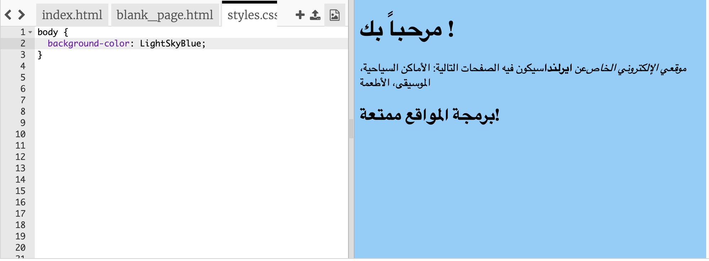
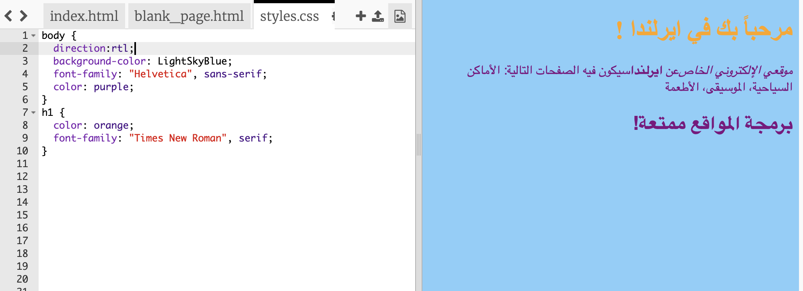

## تحكم في شكلها

لغة البرمجة التي تحدد شكل موقع الويب تسمى ** CSS **.

- انظر إلى علامات التبويب في الجزء العلوي من لوحة البرمجة، وانتقل إلى الملف ` styles.css ` بالضغط على علامة التبويب التي تحمل هذا الاسم. يحتوي الملف على النص التالي:

```css
  الهيئة {
      الخلفية-اللون: أبيض؛
}
```

- قم بتغيير اللون `الأبيض ` اللون إلى ` الأزرق السمائي الفاتح` ونرى ما سيحدث. يجب أن يكون لموقعك الآن خلفية زرقاء! 



## \--- collapse \---

## كيف يعمل؟

إذا نظرت في أعلى ملف `index.html`، سترى السطر التالي:

```html
  <link type="text/css" rel="stylesheet" href="styles.css"/>
```

السطر الذي في الأعلى يخبر المتصفح بالبحث عن ملف خاص يحمل اسم `styles.css`. هذا الملف الخاص يسمى **صفحة الأنماط**. يمكنك التعرف على ملف صفحة الأنماط من خلال `.css` في الأسم.

تحتوي صفحة الأنماط على **قواعد** لكيفية ظهور كل عنصر من عناصر صفحة الويب.

الأقواس المتعرجة `{ }` و البرمجة التي بداخلهم عبارة عن مجموعة من ** قواعد CSS **. الكلمة `body` تعني أن القواعد هي لكل عنصر `<body>` موجود في موقع الويب الخاص بك. نطلق أسم ** المنتقي ** على الجزء الموجود امام الأقواس المتعرجة. لذلك في هذه الحالة ، المنتقي لعناصر الbody.

تتكون كل قاعدة داخل الأقواس المتعرجة من:

- خاصية ** ** على اليسار ، متبوعًا برمز النقطتين `: `
- قيمة ** ** للخاصية على اليمين بعد النقطتين
- رمز الفاصلة المنقوطة `؛` في النهاية

\--- /collapse \---

- لنضيف بعض القواعد لتغيير شكل النص. أضف سطرين جديدين داخل الأقواس المتعرجة:

```css
  الهيئة {
    خلفية-لون الخلفية:الأزرق السمائي الفاتح ;
    الأسرة الخطية:Helvetica", sans-serif;: 
اللون  بنفسجي;
}
```

انظر إلى التغيير على صفحة الويب.

خاصية `color` تخص النص المكتوب دائماً. هنا ، تقوم بتعيين لون النص بالكامل في `محتوى` صفحة الويب الخاصة بك.

- يمكنك أيضًا كتابة قواعد منفصلة للعناوين والفقرات. بالنسبة لعناوين `<h1>` ، يمكنك استخدام منتقي` h1 `. بعد قوس الإغلاق المتعرج الذي يحتوي على قواعد CSS للمحتوى، أضف البرمجة التالي.

```css
  h1 {
    اللون: البرتقالي؛
    الأسرة الخطية: "Times New Roman", serif;
}
```

يجب آن يكون نص العنوان باللون البرتقالي الآن، والفقرات باللون الأرجواني كما في السابق.



لاحظ كيف تبدو الحروف مختلفة بالإضافة لتغير لون الخط؟ هذا لأنك غيرت **شكل الخط**. يمكنك العثور على المزيد من الخطوط [هنا](http://dojo.soy/web-font-families).

- حاول إضافة مجموعة من القواعد لعناوين `<h2>` ، باستخدام منتقي `h2`.

- لماذا لا تجرب ألوان مختلفة للنص والخلفية؟ هناك الكثير من الألوان المتاحة للاستخدام. ستجد قائمة كاملة [هنا](http://dojo.soy/web-color-names).