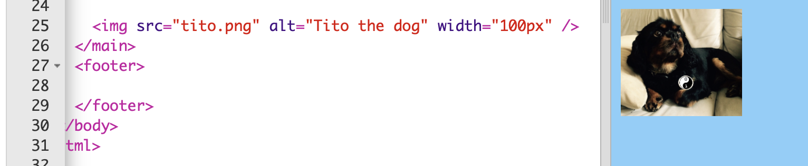
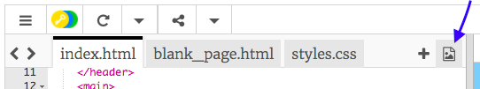

## إضافة صور

دعنا نضيف صورة!

- انتقل إلى علامة التبويب التي تحمل اسم `index.html `. ابحث عن وسم `</main>` واكتب ما يلي **أعلاه** ما يلي: 

```html
    
```

إليك الشكل الذي يجب أن تبدو عليه النتيجة:



لاحظ أن هذا الوسم يحتوي على معلومات إضافية بداخله. يطلق عليهم اسم **سمات**.

- ابحث عن الجزء الذي يقول `width = "100px"` وحاول تجربة أرقام مختلفة لمعرفة ما إذا كان يمكنك معرفة ما تقوم به هذه السمة. لا تمسح الحروف `px`!

--- collapse ---
---
title: كيف يعمل العلامة `img`
---

لاحظ أن العلامة `` مختلفة عن العلامات الأخرى التي استخدمتها حتى الآن - لا يوجد وسم إغلاق `</img>`. بدلاً من ذلك، هذا الوسم **ذا إغلاق ذاتي**: يحتوي على `/>` في نهايته. هذا بسبب عدم وجود "بداية" و "نهاية" لعنصر الصورة كما في النص.

تحتوي العلامة على **سمات** مع معلومات إضافية:

- سمة `src` تخبر المتصفح اي ملف يستخدم كصورة. 
- سمة `alt` تحمل شرح مختصر ليستخدمها المتصفح اذا لم يستطيع إظهار الصورة. 'alt' اختصار ل'alternative' والتي تعني بديل. يساعد هذا النص أيضًا الأشخاص الذين يستخدمون قارئ الشاشة للتعرف على الصورة.
- سمة `width` تخبر المتصفح بعرض الصورة. `100 px` تعني مائة **بكسل**، وهي النقاط الصغيرة التي تشكل ما تراه على شاشتك. إذا لم تقم بتضمين هذه السمة ، فسيتم عرض الصورة بحجمها الأصلي.

--- /collapse ---

الآن بعد أن عرفت الكود لوضع صورة على موقع الويب الخاص بك، ربما تريد تغيير الصورة، أليس كذلك؟

- أول ما ستحتاج إليه هو ، بالطبع ، صورة! يمكنك إما استخدام صورة لديك على جهاز الكمبيوتر الخاص بك، مثل صورة التقطتها، أو يمكنك الحصول عليها من الإنترنت.

[[[generic-get-picture-from-web]]]

**ملاحظة:** ليست كل الصور التي ستجدها على الإنترنت مجانية ليستخدمها أي شخص. إذا قمت بتنزيل صورة ، يجب أن تتأكد من أنها صورة مسموح لك باستخدامها. اكتشف المزيد عن هذا هنا:

[[[images-permissions-to-use]]]

بمجرد حصولك على صورة، يمكنك **تحميل** الملف إلى Trinket:

- في trinket، اضغط على أيقونة **الصورة** بجانب علامة **+**. 



هذا هو المكان الذي يمكنك من خلاله رؤية الصور التي يمكنك استخدامها في موقعك الخاص. يجب أن تشاهد صورة Tito، كلب CoderDojo.

- اضغط زر **Add Image** ثم اضغط **Upload**.

- انقر على الزر **انقر لتحديد الملفات**. ابحث عن ملف صورتك واضغط مرتين عليها في النافذة التي فتحت.

- اضغط على **موافق**.


سيتم تحميل صورتك ويجب أن تكون جاهزة للاستخدام.

- انتقل إلى ملف `index.html` وابحث عن وسم ``. غير النص `tito.png` بحيث يطابق اسم ملف الصورة التي اخترتها تماماً. لاحظ أن اسمه قد ينتهي بـ `.jpg` بدلاً من `.png`!

النص الذي غيرته للتو هو السمة التي تسمى `src`، والتي تخبر المتصفح اي ملف يعرض.

**ملاحظة:** يجب أن تحتوي القيمة التي تكتبها للسمة على علامات اقتباس `""` حولها!

--- challenge ---

## تحدي: تغيير النص البديل للصورة

- أبحث عن سمة `alt` لعنصر الصورة التي إخترتها وغير النص لشرح مختصر عن الصورة. 

--- /challenge ---