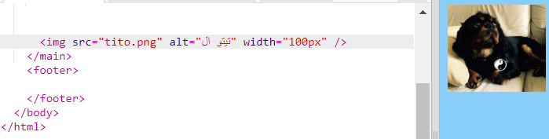

## إضافة صور

دعنا نضيف صورة!

- انتقل إلى علامة التبويب التي تحمل اسم ` index.html `. ابحث عن وسم `</main>` واكتب ما يلي ** أعلاه ** ما يلي: 

```html
    
```

إليك الشكل الذي يجب أن تبدو عليه النتيجة:



لاحظ أن هذا الوسم يحتوي على معلومات إضافية بداخله. يطلق عليهم اسم **سمات**.

- ابحث عن الجزء الذي يقول ` width = "100px" ` وحاول تجربة أرقام مختلفة لمعرفة ما إذا كان يمكنك معرفة ما تقوم به هذه السمة. لا تمسح الحروف `px`!

## \--- collapse \---

## title: How the `img` tag works

Notice that the `` tag is different from the other tags you've used so far — there is no closing `</img>` tag. Instead, this tag is **self-closing**: it has `/>` at the end. This is because there is no 'start' and 'end' to an image element like there is for text on the page.

The tag contains **attributes** with extra information:

- سمة `src` تخبر المتصفح اي ملف يستخدم كصورة. 
- سمة `alt` تحمل شرح مختصر ليستخدمها المتصفح اذا لم يستطيع إظهار الصورة. 'alt' اختصار ل'alternative' والتي تعني بديل. يساعد هذا النص أيضًا الأشخاص الذين يستخدمون قارئ الشاشة للتعرف على الصورة.
- سمة `width` تخبر المتصفح بعرض الصورة. ` 100px ` تعني مائة **بكسل**، وهي النقاط الصغيرة التي تشكل ما تراه على شاشتك. إذا لم تقم بتضمين هذه السمة ، فسيتم عرض الصورة بحجمها الأصلي.

\--- /collapse \---

Now that you know the code to put a picture on your website, you probably want to change the picture, right?

- أول ما ستحتاج إليه هو ، بالطبع ، صورة! يمكنك إما استخدام صورة لديك على جهاز الكمبيوتر الخاص بك، مثل صورة التقطتها، أو يمكنك الحصول عليها من الإنترنت.

[[[generic-get-picture-from-web]]]

**Note:** not all images you will find on the internet are free for anyone to use. If you download a picture, you should make sure it is one that you are allowed to use. Find out more about this here:

[[[images-permissions-to-use]]]

Once you have a picture, you can **upload** the file to Trinket:

- في trinket، اضغط على أيقونة **الصورة** بجانب علامة **+**. 


This is where you can see the pictures that you are able to use on your website. You should see the picture of Tito, the CoderDojo dog.

- اضغط زر **Add Image** ثم اضغط **Upload**.

- اضغط زر **Click To Select Files**. ابحث عن ملف صورتك واضغط مرتين عليها في النافذة التي فتحت.

- اضغط على **موافق**.


Your picture will be uploaded and should be ready to use.

- انتقل إلى ملف `index.html` وابحث عن وسم ``. غير النص`tito.png` بحيث يطابق اسم ملف الصورة التي اخترتها تماماً. لاحظ أن اسمه قد ينتهي بـ`.jpg` بدلاً من `.png`!

The text you just changed is the attribute called `src`, which tells the browser which file to display.

**Note:** the value you type for an attribute must have quotation marks `""` around it!

\--- challenge \---

## Challenge: change the alt text of the picture

- أبحث عن سمة `alt` لعنصر الصورة التي إخترتها وغير النص لشرح مختصر عن الصورة. 

\--- /challenge \---