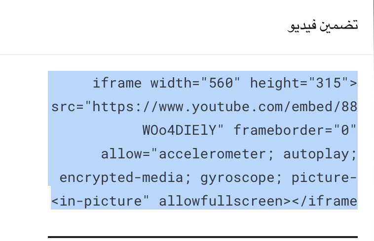
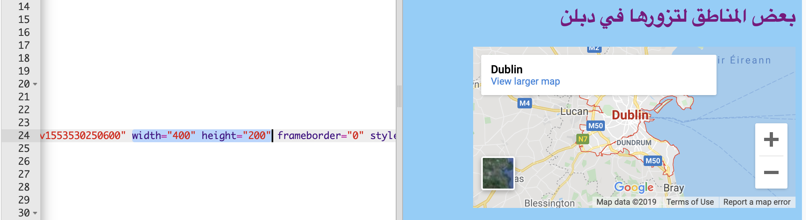

## إضافة خارطة او فيديو

يوفر YouTube طريقة سهلة لإضافة مقاطع الفيديو الخاصة به على موقعك الخاص. تسمى عملية إضافة عناصر من مصادر أخرى عبر الإنترنت إلى موقعك الخاص **تضمين**.

- ابحث عن مقطع فيديو على YouTube تريد عرضه على موقع الويب الخاص بك.

- أضغط على زر**مشاركة** أدنى الفيديو. إختر الخيار **تضمين**.

سترى مربع نص مع النص المحدد بالكامل. إذا قمت بإلغاء تحديد النص عن طريق الخطأ، فيمكنك تحديده مرةً أخرى من خلال الضغط عليه والضغط على زر<kbd> Ctrl </kbd> (أو <kbd> cmd </kbd> على الMac) و زر <kbd>A</kbd> في نفس الوقت.

- اضغط على زر<kbd> Ctrl</kbd> (أو <kbd> cmd</kbd> على جهاز Mac) وزر <kbd> C</kbd> معا لنسخ النص.

- ثم ارجع إلى كود ال HTML لموقع الويب الخاص بك، واضغط في المكان الذي تريد وضع الفيديو فيه، على سبيل المثال بعد احد العناوين او الفقرات. **الصق** الكود عن طريق الضغط على <kbd> Ctrl </kbd> (أو <kbd> cmd </kbd> على Mac) و <kbd> V </kbd> على لوحة المفاتيح في نفس الوقت. لا تقلق بشأن فهم كل الكود الذي قمت بلصقه للتو!

يجب أن يظهر الفيديو على صفحة الويب الخاصة بك.

نفس الطريقة تصلح لخرائط جوجل كذلك. جرِّبها!

- اذهب إلى [هنا](http://dojo.soy/google-maps) وابحث عن مكان تريد عرضه على موقع الويب الخاص بك. ** ملاحظة: ** ** لا ** تقم بمشاركة معلوماتك الشخصية مثل عنوان منزلك على موقع على شبكة الإنترنت!

- اضغط على النتيجة ، ثم اضغط على زر **مشاركة**، وانسخ الرمز وقم بإضافته في موقع الويب الخاص بك على النحو الوارد أعلاه. 

- إذا نظرت بعناية ، يجب أن تجد ** سمات **`العرض` و`الارتفاع` في الكود الملصق. يمكنك تغيير قيمتهما لجعل الخريطة تظهر أكبر أو أصغر.

