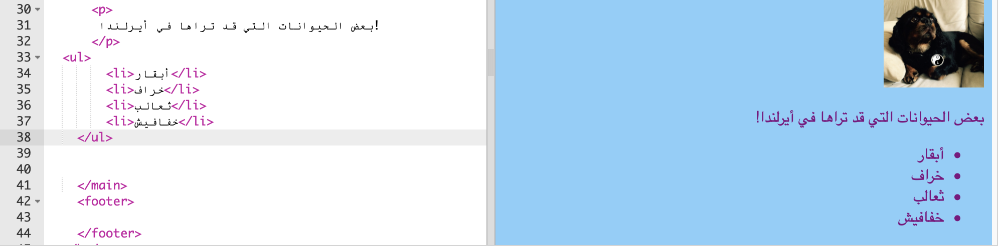
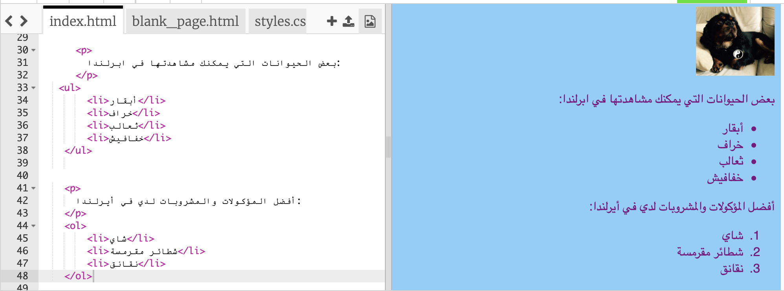

## إنشاء قائمة

ستتعلم الآن كيفية تحويل قائمة العناصر ، مثل "وحيد القرن ، روبوتات ، قطط" ، إلى قائمة لطيفة المظهر يمكنك القيام بأشياء رائعة بها في وقت لاحق.

- في ملف `index.html`، أضف الكود التالي فوق السطر الذي يحتوي `</main>`:

```html
    <ul>
        <li>أبقار</li>
        <li>خراف</li>
        <li>ثعالب</li>
        <li>خفافيش</li>
    </ul>
```

النتيجة يجب ان تكون قائمة لطيفة الشكل مثل هذه:



لاحظ أن هناك زوج منفصل من علامات `<li> و</li>` حول كل عنصر في القائمة.

هذه قائمة ببعض الحيوانات التي قد تراها في أيرلندا. يمكنك تغيير العناصر الموجودة في القائمة إلى أشياء معقولة لموقع الويب الخاص بك ، وإضافة فقرة أعلى القائمة لوصف القائمة ، إذا أردت!

ماذا عن إذا كنت تريد قائمة مرقمة؟ نفس الشيء تقريباً، ولكن بدلا من `<ul>` ، يمكنك استخدام `<ol>`. تسمى القائمة المرقمة بـ قائمة **مرتبة**.

- أضف الكود التالي أسفل الكود الذي كتبته للتو - تأكد من أنه **أسفل** رمز `</ul>`!

```html
    <p>
      أفضل المؤكولات والمشروبات لدي في أيرلندا:
    </p>
    <ol>
        <li>شاي</li>
        <li>شطائر مقرمشة</li>
        <li>نقانق</li>
    </ol>
```

إليك ما يجب أن تبدو عليه الآن:



--- challenge ---

## التحدي: إضافة نمط إلى القوائم الخاصة بك

- أنظر إذا كان يمكنك إضافة **قواعد CSS** إلى ورقة الأنماط الخاصة بك لتغيير شكل قوائمك.

--- /challenge ---