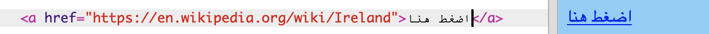

## إنشاء روابط

في هذه البطاقة، ستتعرف على كيفية إنشاء رابط ينقلك إلى صفحة أخرى عند الضغط عليه.

- أضف الكود التالي إلى قسم النص في ملف `index.html`:

```html
  <a href="">أضغط هنا</a>
```

رمزان `<a> </a>` يحولان كل ما بينهما إلى رابط.

- حاول النقر على الرابط الخاص بك لمعرفة ماذا سيحدث. لا يفعل شيئا ، أليس كذلك؟

ذلك لأن سمة `href` فارغة في الوقت الحالي. يجب أن تحتوي على عنوان URL (عنوان الويب) للصفحة التي تريد الذهاب لها.

- اذهب إلى ويكيبيديا وابحث عن صفحة حول شيء ما على موقع الويب الخاص بك. أنا سأستخدم الصفحة الخاصة بأيرلندا.

- انقر في شريط العناوين وحدد كل النص. هذا هو عنوان URL الكامل للصفحة التي أنت فيها. اضغط على <kdb>Ctrl</kdb> (أو <kdb>cmd</kdb>) و <kdb>C</kdb> في لوحة المفاتيح في نفس الوقت.
    
    

- في trinket، انقر بين علامات الاقتباس بعد `href =` واضغط على <kdb>Ctrl</kdb> (أو <kdb>cmd</kdb>) و <kdb>V</kdb> في لوحة المفاتيح في نفس الوقت للصق عنوان URL الذي قمت بنسخه للتو. الكود الخاص بك يجب أن يبدو مثل هذا الآن:

```html
  <a href="https://en.wikipedia.org/wiki/Ireland"> انقر هنا </a>
```

لقد أنشأت أول رابط خاص بك! انقر عليها لمعرفة ما إذا كان يعمل الآن.



--- collapse ---
---
title: روابط لمواقع أخرى
---

Trinket لديه مشكلة مع بعض عناوين الويب. يمكنك تجربة عناوين URL لمواقع غير ويكيبيديا إذا أردت ، لكنها قد لا تعمل في trinket. ومع ذلك ، إذا كنت ستقوم بتنزيل مشروعك وعرض الملفات في مستعرض ويب ، فستشاهد الروابط تعمل.

--- /collapse ---

- حاول وضع صورة بين `<a> </a>` العلامات بدلاً من الكلمات `انقر هنا` ، كالتالي:

```html
  <a href="https://en.wikipedia.org/wiki/Ireland">
      
  </a>
```

- انقر على الصورة. هل ترى أنها تحولت إلى رابط؟

يمكنك وضع رابط في عناصر أخرى من صفحة الويب أيضًا ، على سبيل المثال في فقرة أو حتى في قائمة. فيما يلي مثال على جملة بها رابط:

```html
  <p>
    <a href="https://en.wikipedia.org/wiki/Ireland"> انقر هنا </a> لقراءة صفحة ويكيبيديا!
  </p>
```

--- challenge ---

## تحدي: ضع رابط في قائمة

- انظر إذا كان يمكنك إنشاء قائمة تحتوي على رابط داخل أحد عناصر القائمة.

--- /challenge ---