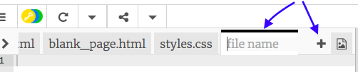
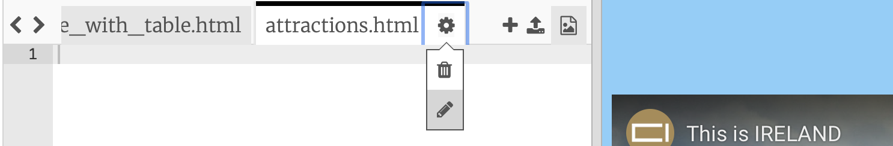
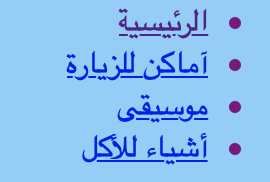

## إضافة المزيد من الصفحات

ستوضح لك هذه البطاقة كيفية إضافة المزيد من الصفحات إلى موقعك على الويب.

- في الجزء العلوي من لوحة البرمجة ، انقر على رمز **+** بجانب علامات التبويب ، واكتب اسمًا للملف الجديد. يجب أن ينتهي بـ `.html ` (بما في ذلك النقطة!) بحيث يعرف المتصفح أنها صفحة ويب.



## \--- collapse \---

## title: إعادة تسمية او حذف الملف

إذا كنت ترغب في تغيير اسم الملف ، فانقر على أيقونة **الترس** على يمين اسم الملف ، ثم انقر فوق أيقونة **قلم الرصاص**. اكتب الاسم الجديد واضغط على زر** Enter **. يمكنك أيضًا حذف ملف عن طريق النقر فوق أيقونة **الحاوية ** بدلاً من أيقونة **قلم الرصاص**. 

قد تتساءل لماذا لا يمكنك تغيير اسم ملف`index.html`. `index.html` هو اسم خاص يستخدم **للصفحة الرئيسية** من الموقع. هذه هي الصفحة الأولى التي تكون فيها عند زيارة الموقع الإلكتروني. كلما انتقلت إلى الصفحة الرئيسية لموقع ويب ، يبحث المستعرض عن الملف المسمى ` index.html ` ويعرضه على الشاشة.

\--- /collapse \---

- ابحث عن الملف ` blank_page.html ` وانسخ كل البرمجة التي فيه والصقها في الملف الجديد. نظرًا لأنك ترغب في نسخ كل شيء ، يمكنك النقر في أي مكان على الكود واستخدام اختصار لوحة المفاتيح <kbd> Ctrl </kbd> (أو <kbd> cmd </kbd>) و <kbd>A</kbd> لتحديد الكل في نفس الوقت.

- غير النص بين الرمزين `<title> </title>` ليكون لصفحتك الجديدة عنوان مناسب. لن يعرض Trinket العنوان ، ولكن يمكنك رؤيته في الجزء العلوي من نافذة المتصفح إذا قمت بتنزيل مشروعك.


- بين رمزين `<main> </main>` في الملف الجديد ، استخدم العلامات التي تعلمتها حول إضافة أشياء إلى الصفحة ، مثل الفقرات والعناوين والصور والقوائم!

- كرر الخطوات المذكورة أعلاه لكل صفحة جديدة تريد إضافتها.

عندما يكون هناك العديد من علامات التبويب في Trinket لعرضها في وقت واحد ، يمكنك استخدام أيقونات ** < ** و **> ** في الزاوية العلوية اليمنى من علامات التبويب للتنقل بينها.


الآن أنت بحاجة إلى إنشاء روابط حتى تتمكن من الوصول إلى كل صفحة من صفحاتك الجديدة! دعنا نضع كل الروابط في القائمة.

- في ملف ` index.html `، أضف الكود التالي إلى محتوى صفحة الويب الخاصة بك:

```html
    <ul>
       <li><a href="index.html">الرئيسية</a></li>
       <li><a href="attractions.html">أماكن للزيارة</a></li>
       <li><a href="music.html">موسيقى</a></li>
       <li><a href="food.html">مأكولات</a></li>
    </ul>
```

- غيّر قيمة سمة `href` لكل رابط (تذكر ، هذا هو النص الموجود داخل علامات الاقتباس) بحيث يطابق تمامًا اسم كل ملف HTML قمت بإنشائه.

- غير النص بين رموز `<a> و</a>` إلى وصف مناسبة لصفحاتك.

يمكنك الآن الانتقال إلى صفحاتك الجديدة!

