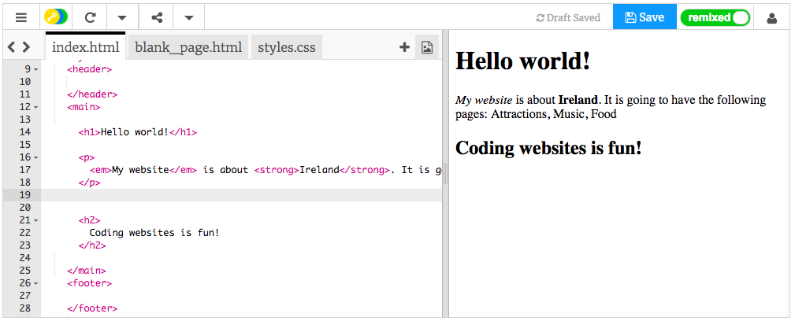

## Your first webpage!

- In the left-hand panel, the **code panel**, click on the tab that says `index.html`.

- Find the line that says `Welcome to Ireland!` and change it to your own message — be careful **not** to delete the tags`<p>` at the start of the line and `</p>` at the end of the line. You should see your webpage update in the right-hand panel.


- Now on the same line, change the `<p>` and `</p>` to `<h1>` and `</h1>`. Do you notice any change in the result on the right?

```html
  <h1>Welcome to Ireland!</h1>
```

## \--- collapse \---

## title: HTML and tags explained

**HTML** is the code that makes a webpage.

The `.html` in the file name tells the browser that the file is a webpage, so the browser knows to look for **tags** telling it what to display. (A browser is the program you use to look at websites, for example Chrome or Firefox.)

HTML tags such as `<p>` and `</p>` define different pieces of a page, for example paragraphs, headings, or the body. The pieces are all called **elements**. Think of them as building blocks.

### Why do I need two tags?

You need an **opening** and a **closing** tag to tell the browser where elements **start** and **end**. So for a paragraph, the opening `<p>` tag says "Here comes some text that I want you to display as a paragraph." The closing `</p>` tag tells the browser where the paragraph ends.

Everything in between the `<body>` and `</body>` tags is your webpage.

- Notice how the closing tag **always** has a forward slash `/`.

\--- / collapse \---

- Try changing the numbers in your **heading** tags to see the different sizes they give you. They can go from `<h1>` all the way up to `<h6>`. Remember to change both the opening and closing tag so that they match.

- Find the code for the paragraph that says `My website is about Ireland.` and change it so that it looks like this:

```html
  <p>
    <em>My website</em> is about <strong>Ireland</strong>. 
    It is going to have the following pages: Attractions, Music, Food
  </p>
```

Can you work out what the `<em> </em>` and `<strong> </strong>` tags do?



\--- challenge \---

## Challenge: add some more text of your own

- Try adding a new paragraph or heading to your page using some of the tags you've learned about.

\--- hints \---

\--- hint \---

When you want to put text on a page, you need to put it in between two tags that tell your browser how to display your text. For example, the `<p> </p>` tags tell the browser that whatever is in between them is a new paragraph of text, and the `<h1> </h1>` tags tell it that the text in between is a heading.

\--- /hint \---

\--- hint \---

The code for paragraphs looks like this:

```html
  <p>This is one paragraph of text.</p>

  <p>This is another paragraph.
  Everything in between one set of p tags is 
  displayed together in one long line on the webpage.</p>
```

\--- /hint \---

\--- hint \---

The code for headings looks like this:

```html
  <h1>This is a heading.</h1>
```

Headings will normally be displayed bigger or bolder than the paragraphs.

\--- /hint \---

\--- /hints \---

\--- /challenge \---

Congratulations, you've built your first webpage! On the next card, you'll find out how to control how it looks.