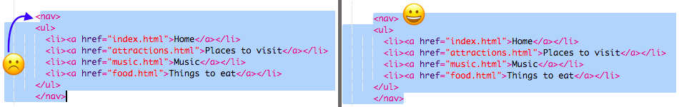

## Navigieren auf deiner Website

Viele Websiten verfügen über ein **Navigations**menü, damit Besucher zwischen den Seiten wechseln können. Nachdem du nun einige Seiten hast, eine Homepage und auch Links zu jeder Seite, lass uns die Liste der Links in einen Navigationsbereich oben auf jeder Seite verschieben.


- Suche den Code für deine Linkliste, die du im vorigen Schritt erstellt hast.

- Direkt vor dem öffnenden `<ul>` Tag, drücke die **Eingabetaste**, um eine neue leere Zeile zu erstellen. Trage dann folgenden Tag in die neue Zeile ein: `<nav>`. Trinket fügt den schließenden Tag direkt danach automatisch hinzu, aber du kannst ihn löschen - er steht nicht an der richtigen Stelle.

- Direkt **hinter** dem schliessenden `</ul>`Tag, drücke die **Eingabetaste**, um eine neue Zeile zu erstellen und füge den schließenden `</nav>` Tag ein.

- Jetzt wähle deinen gesamten `<nav>` Abschnitt und deine Liste aus, in dem du kurz vor den öffnenden `<nav>` Tag klickst und die Maus bis ganz unten, kurz hinter den schliessenden `</nav>` Tag ziehst, damit der gesamte Text samt öffnenden und schließenden Tags hervorgehoben ist. Stelle sicher, dass alle **spitzen Klammern** `<` und `>` vorhanden und hervorgehoben sind!



- Diesmal wirst du **ausschneiden** statt kopieren. Drücke die <kbd>Strg</kbd> (oder <kbd>cmd</kbd>) und gleichzeitig die <kbd>X</kbd> Taste. Der markierte Code verschwindet, aber keine Panik!

- Ganz oben in der Datei, drücke zwischen die `<header></header>` tags. Stelle sicher, dass der Cursor dort blinkt. Nun füge den Code ein, in dem du wie gewohnt <kbd>Strg</kbd> (oder <kbd>cmd</kbd>) und <kbd>V</kbd> drückst. Der Code sollte ungefähr so aussehen:

```html
    <header>
        <nav>
            <ul>
            <li><a href="index.html">Start</a></li>
            <li><a href="attractions.html">Attraktionen</a></li>
            <li><a href="music.html">Musik</a></li>
            <li><a href="food.html">Essen</a></li>
            </ul>
        </nav>
    </header>
```

## \--- collapse \---

## title: Rückgängig machen!

Falls du einen Fehler machst, kannst du es **rückgängig machen** indem du <kbd>Strg</kbd> (oder <kbd>cmd</kbd>) und <kbd>Z</kbd> gleichtzeitig drückst. Normalerweise kannst du diese Tastenkombination mehrere Male anwenden, um die letzten Änderungen rückgänging zu machen. Dies ist eine weitere, praktische Tastenkombination, die du in vielen Programmen benutzen kannst!

\--- /collapse \---

- Teste deine Links, um sicherzustellen, dass sie noch funktionieren.

-- challenge \---

## Challenge: Navigationsmenü für alle Seiten

- Packe diesen Code-Abschnitt in den Header Abschnitt jeder HTML Datei, die du erstellt hast. Das lässt das Navigationsmenü oben auf jeder Seite deiner Website erscheinen.
    
    \--- hints \---
    
    \--- hint \---

Select the entire `<nav>` section like you did before, and press the <kbd>Ctrl</kbd> (or <kbd>cmd</kbd>) and <kbd>C</kbd> keys together to copy it.

Then, in each of your `.html` files, click inside the `<header> </header>` section and paste the code exactly like you did earlier.

\--- /hint \---

\--- /hints \---

Now you will be able to click the links no matter which page you are on.

\--- /challenge \---