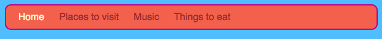

## Eine Menüleiste erstellen

Auf dieser Karte wirst du sehen, wie du dein Navigationsmenü in eine coole Menüleiste verwandeln kannst, indem du dem Stylesheet mehr CSS-Regeln hinzufügst.



- Wechsle zum Stylesheet im Reiter `styles.css`. Klicke **unter** eine schließende geschweifte Klammer `}` und drücke die **Eingabetaste**, um eine neue Leerzeile zu erstellen. Füge die folgende CSS Regel hinzu:

```css
    nav ul {
        background-color: tomato;
    }
```

Hast du bemerkt, dass du statt einem Selektor zwei verwendest? Wenn du nur den `ul` Selektor benutzt hättest, würde die Regel alle ungeordneten Listen auf deiner Website betreffen. Der zusätzliche `nav` Selektor führt dazu, dass die Regel nur die Listen betrifft, die zwischen `nav` Tags stehen.


Lass uns die Aufzählungspunkte loswerden. Das sind die Punkte vor jedem Listenelement.

- Füge den folgenden Code der `styles.css` Datei hinzu. Wie vorher, füge eine neue Zeile nach einer `}` ein, damit der Code nicht innerhalb eines anderen Regelblock steht.

```css
    nav ul li {
        list-style-type: none;
    }
```

Beachte, dass diese Regel drei Selektoren verwendet: Es wählt alle `li` Elemente, die in einer `ul` Liste stehen, die sich wiederum in einem `nav` Tag befindet. Puh!


Lass uns jetzt die Liste waagrecht (d.h. quer) statt senkrecht (d.h. von oben nach unten) machen.

- Füge der neu erstellten CSS Regel folgende Zeile hinzu: `display: inline;`.


- Die Menüelemente sind jetzt alle zusammengequetsch, also füge die Eigenschaften `margin-right` (Abstand rechts) und `margin-left` (Abstand links) hinzu, um sie ein wenig zu verteilen. Der CSS-Code sollte jetzt so aussehen:

```css
    nav ul li {
        list-style-type: none;
        display: inline;
        margin-right: 10px;
        margin-left: 10px;
    }
```

Denke daran: `10px` bedeutet zehn Pixel.

Wie wäre es, wenn du das Menü so änderst, dass es dir sagt, auf welcher Seite du dich befindest? Dieser Teil wird nicht im Stylesheet sein.

- Beginne mit der Homepage. Gehe zurück zu deiner `index.html` Datei. Entferne die Link-Tags vor und nach dem Wort `Start` in der Liste der Menülinks, damit das Listenelement für die Homepage nur als Text zwischen `<li></li>` Tags steht, so wie hier: `<li>Start</li>`.

- Gehe durch alle anderen Dateien und mache die gleiche Änderung - aber ändere jedesmal die Link-Tags der jeweiligen Seite. Zum Beispiel, in der Datei `music.html` habe ich die Link-Tags vom `Musik` Listenelement entfernt:

```html
    <header>
        <nav>
            <ul>
            <li><a href="index.html">Start</a></li>
            <li><a href="attractions.html">Attraktionen</a></li>
            <li>Musik</li>
            <li><a href="food.html">Essen</a></li>
            </ul>
        </nav>
    </header>
```

- Klicke auf die Links und schaue die verschiedenen Seiten an. Siehst du wie der Name der jeweils aktiven Seite als einfacher Text dargestellt wird statt als Link? 


Auf der nächsten Karte lernst du noch mehr CSS-Tricks, um die Menüleiste total cool aussehen zu lassen.