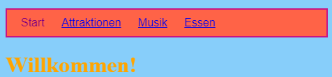
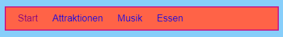
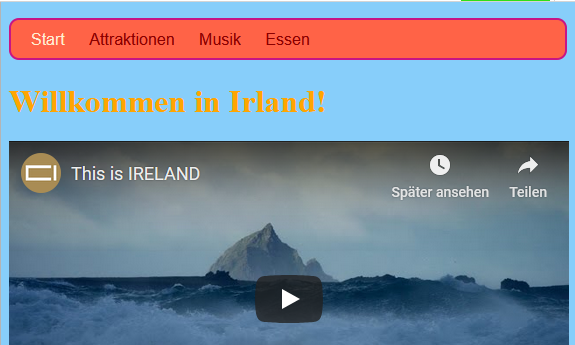

## Die Menüleiste gestalten

Mit CSS gibt es unendlich viele Möglichkeiten, die Menüleiste gut aussehen zu lassen.

- Wechsle noch einmal in die Datei `styles.css` - da wo das cooles Zeugs passiert!

- Finde den `nav ul` Selektor und füge weitere Regeln hinzu, so dass es so aussieht:

```css
  nav ul {
    background-color: tomato;
    border-style: solid;
    border-color: MediumVioletRed;
    border-width: 2px;
    padding: 10px;
  }
```

Die `padding` Eigenschaft fügt Zwichenräume hinzu. Findest du heraus, was die anderen Eigenschaften bewirken? Probiere es aus mit anderen Farben und verschiedenen Anzahl Pixel.



- Um die Unterstreichung der Links zu entfernen, füge den folgenden Code nach der schließende geschweifte Klammer `}` der `nav ul li` Regeln hinzu. Du kannst es nach einer beliebigen `}` platzieren aber es ist eine gute Idee, verwandte Sachen zusammenzuhalten, damit es später einfacher zu finden ist!

```css
  nav ul li a {
      text-decoration: none;
  }
```

Die obige Regel gilt für Links `<a>` innerhalb von Listenelementen `<li>` in einer ungeordneten Liste `<ul>` innerhalb eines Navigationsbereichs `<nav>`. Wow, das sind vier Selektoren!



Erinnerst du dich, wie du die Link-Tags aus einigen Listenelementen in `<nav>` entfernt hast, um leichter zu sehen, auf welcher Seite du dich befindest? Warum änderst du nicht auch die Textfarbe der Navigationslistenelemente, die keine Links sind!

- Finde deinen `nav ul li` Selektor und **innerhalb** der geschweiften Klammern füge diese Zeile hinzu:

```css
  color: PapayaWhip;
```

Du kannst eine beliebige Farbe wählen!

Du könntest die `color` (Farbe) Eigenschaft auch der `nav ul li a` Regel hinzufügen, wenn du möchtest, dass die Menü-Links anders gefärbt sind als die anderen Links auf deiner Website.

- Wie wär's mit abgerundeten Ecken für dein Menü? Füge mal folgenden Code zur `nav ul` Regel hinzu und schau was passiert: `border-radius: 10px;`.

Die `border-radius` (Rahmenradius) Eigenschaft ist eine wirklich einfache Möglichkeit, allesmögliche cooler aussehen zu lassen!



\--- challenge \---

## Herausforderung: Bilder mit runden Ecken

- Erstelle in deinem Stylesheet eine neue Regel für Bilder, indem du den `img` (image, d.h. Bild) Selektor einsetzt, und füge dort eine `border-radius` Regel ein.

\---/challenge\---