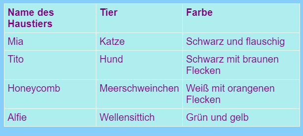

## Eine Tabelle hinzufügen

Manchmal kann es praktisch sein, Informationen in einer Tabelle darzustellen. Zum Beispiel auf einer Website von einem Sportverein oder einer Schule könntest Du Mitgliederinformationen auflisten, oder auf Informationen zu deinen zehn Lieblingssongs.

Eine Tabelle ist ein Raster aus **Zeilen** und **Spalten**. Außerdem haben die meisten Tabellen oben eine **Kopfzeile**, in der der Titel von jeder Spalte steht. Hier ist ein Beispiel:



- Wechsle zur Datei `page_with_table.html`. Dort siehst du einen Batzen Code zwischen `<table> </table>` Tags.

- Markiere den gesamten Code vom Anfang des `<table>`-Tags bis zum Ende des schließenden ` </table>`-Tags und kopiere ihn. Wechsle dann zu einer deiner Dateien, in die du eine Tabelle einfügen möchtest und füge den Code ein.

Momentan ist die Tabelle leer.

- Versuche mal, die Tabelle mit irgendwas zu füllen! Trage einfach einen Text zwischen die `<td> </td>` Tags (td = table data = Tabellendaten) und zwischen die `<th> </th>` Tags (th = table header = Tabellenkopf) ein. Bei Bedarf kannst Du weitere Tags hinzufügen.

--- collapse ---
---
title: Beispielcode
---

Der HTML-Code von der obigen Tabelle sieht so aus:

```html
  <table>
    <tr>
      <th>Name des Haustiers</th>
      <th>Tier</th>
      <th>Farbe</th>
    </tr>
    <tr>
      <td>Mia</td>
      <td>Katze</td>
      <td>Schwarz und flauschig</td>
    </tr>
    <tr>
      <td>Tito</td>
      <td>Hund</td>
      <td>Schwarz mit braunen Flecken</td>
    </tr>
    <tr>
      <td>Honeycomb</td>
      <td>Meerschweinchen</td>
      <td>Weiß mit orangenen Flecken</td>
    </tr>
    <tr>
      <td>Alfie</td>
      <td>Wellensittich</td>
      <td>Grün und gelb</td>
    </tr>
  </table>
```

--- /collapse ---

Um noch eine **Zeile** hinzuzufügen, füge ein weiteres Paar `<tr> </tr>` Tags hinzu. Dazwischen platzierst Du **Daten** Elemente mit `<td> </td>` Tags. Die Anzahl muss die Gleiche sein, wie in den anderen Zeilen.

Um eine weitere **Spalte** hinzuzufügen, füge **jeder** Zeile ein zusätzliches **Daten** Element mit einem Satz `<td> </td>` Tags hinzu. Füge der ersten Zeile auch einen zusätzlichen **Tabellenkopf** mit `<th> </th>` Tags hinzu.

--- collapse ---
---
title: Wie funktioniert es?
---

Schauen wir uns all diese Tags an. Es ist ein bisschen wie der Code von einer Liste (d.h. `<ul>` und `<ol>`) aber mit mehr Ebenen.

Jedes Paar `<tr></tr>`Tags ergibt eine Zeile (engl: row, daher tr) und daher wird alles zwischen den Tags auf einer Höhe dargestellt.

Die erste Zeile enthält `<th> </th>` Tags. Diese werden für die Überschriften (engl: Headings) verwendet und so stehen die Spaltentitel dazwischen. Es gibt ein Paar für jede Spalte in deiner Tabelle.

Die `<td></td>`Tags definieren die sogenannten Tabellen-Daten und die stehen in allen anderen Zeilen. Diese ähneln den Listenelement-Tags `<li> </li>`: Alles dazwischen ist ein Element in einer Tabellenzeile.

--- /collapse ---

- Am Ende der `styles.css` Datei siehst du den CSS Code, der das Aussehen der Tabelle bestimmt. Du musst nicht alles verstehen! Du kannst aber ein bisschen herumexperimentieren, indem du die Text-, Rahmen- und Hintergrundfarben änderst und deinen eigenen Stil entwickelst.

```css
  table, th, td {
    border: 1px solid HoneyDew;
    border-collapse: collapse;
  }
  tr {
    background-color: PaleTurquoise;
  }
  th, td {
    vertical-align: top;
    padding: 5px;
    text-align: left;
  }
  th {
    color: purple;
  }
  td {
    color: purple;
  }
```

Hast du bemerkt, wie einige Selektoren Kommas verwenden, z.B. `table, th, td`? Das ist eine **Liste von Selektoren**: das bedeutet, dass es auf alle `<th>` Elemente und alle `<td>` Elemente angewendet wird. Es erspart dir, die gleichen Regeln für jeden Selektor zu tippen!