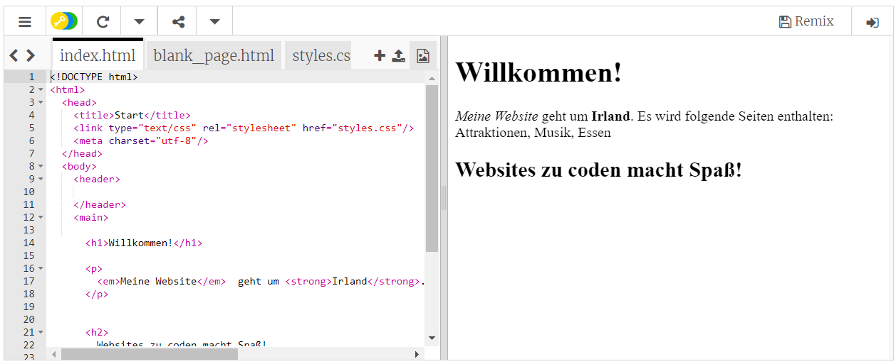

## Erste Schritte

- Gehe zum [Starter Trinket](http://dojo.soy/html-b-start). Dort siehst du ein Feld, das ein Beispiel für ein Website-Projekt enthält. Auf der rechten Seite befindet sich die Website und auf der linken Seite der Code, der die Website erstellt. 

## \--- collapse \---

## title: Ich habe ein Trinket-Konto

- Klicke oben rechts im Projekt auf die Schaltfläche **Remix**. Wenn du noch nicht angemeldet bist, wirst du dazu aufgefordert dich anzumelden. Sobald du angemeldet bist, musst du erneut auf **Remix** klicken. Nachdem du auf diese Schaltfläche geklickt hast, wird eine Kopie des Projekts erstellt, mit der du arbeiten kannst. 

Dort sollte nun **remixed** stehen, nachdem du es angeklickt hast:

\--- /collapse \---

## \--- collapse \---

## title: Ich habe kein Trinket-Konto

Du kannst deine Arbeit speichern, indem du auf eine der Optionen im Menü **Share** klickst. Du erhältst dann einen Link, den du entweder irgendwo abspeichern kannst, zum Beispiel in einer Textdatei, oder jemandem per Email schicken kannst. **Hinweis:** Jedes Mal, wenn du eine Änderung vornimmst, erhältst du einen neuen Link.

Wenn du ein Konto bei Trinket erstellen möchtest, führe die unten beschriebenen Schritte durch. So kannst du von einem beliebigen Computer aus einfach auf deine Arbeit zugreifen und Projekte **remixen**, die jemand mit dir geteilt hat. Remixen bedeutet, dass du eine Kopie eines Projekts speicherst, damit du selbst Änderungen daran vornehmen kannst.

- Gehe zur [Trinket-Website](http://dojo.soy/trinket) und klicke auf **Sign Up For Your Free Account**. Du brauchst eine E-Mail-Adresse, um dich anzumelden.

- Gib deine E-Mail-Adresse ein und wähle ein Passwort oder bitte jemanden darum, das für dich zu machen.

- Du kannst nun auf alle deine gespeicherten oder geremixten Projekte zugreifen, indem du auf deinen Benutzernamen klickst und zu **My Trinkets** gehst. 

\--- /collapse \---

Los geht's mit dem Programmieren!