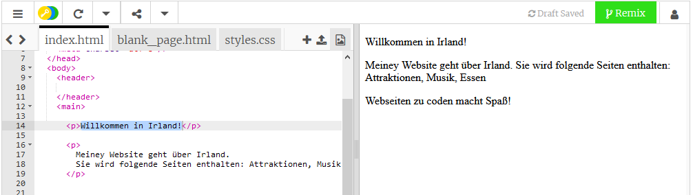
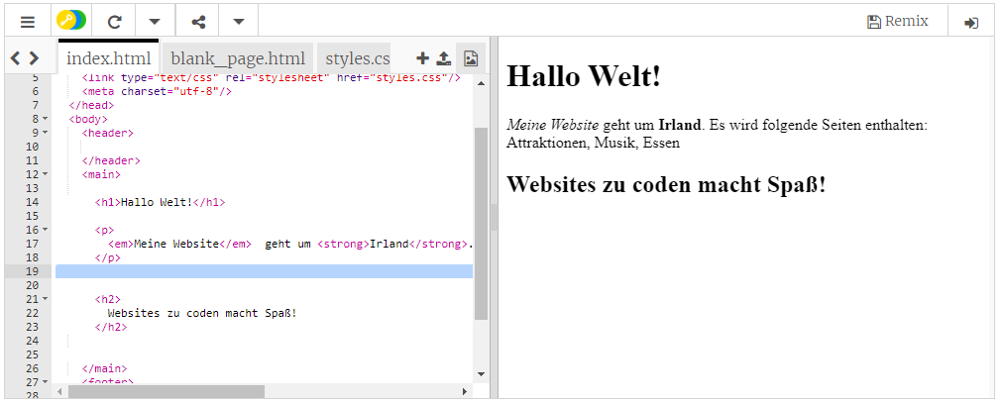

## Deine erste Website!

- Klicke auf der linken Seite, dem **code Bereich**, auf den Reiter `index.html`.

- Finde die Zeile, `Willkommen in Irland!` und ändere diese in deine eigene Nachricht — achte darauf, dass du die Tags `<p>` am Anfang der Zeile und `</p>` am Ende der Zeile **nicht** löschst. Deine Website sollte sich auf der rechten Seite entsprechend aktualisieren.



- Ändere nun in derselben Zeile die Werte `<p>` und `</p>` bis `<h1>` und `</h1>`. Siehst du eine Änderung im Ergebnis auf der rechten Seite?

```html
  <h1>Willkommen in Irland!</h1>
```

## \--- collapse \---

## title: HTML und Tags erklärt

**HTML** ist der Code, der eine Webseite generiert.

Das `.html` im Dateinamen teilt dem Browser mit, dass die Datei eine Webseite ist, sodass der Browser weiß, dass er nach **Tags** suchen soll, die ihm sagen, was er anzeigen soll. (Ein Browser ist das Programm, mit dem du Websites aufrufst, zum Beispiel Chrome oder Firefox.)

HTML-Tags wie `<p>` und `</p>` definieren verschiedene Teile einer Seite, zum Beispiel Absätze, Überschriften oder Hauptteil. Die Teile werden **Elemente** genannt. Betrachte sie als Bausteine.

### Warum brauche ich zwei Tags?

Du brauchst einen **öffnenden** und einen **schließenden** Tag, um dem Browser mitzuteilen, wo das Element **startet** und **endet**. Also für einen Absatz, sagt der öffnende `<p>` Tag "Hier kommt ein Text und der soll als Absatz angezeigt werden." Der schließende `</p>` Tag teilt dem Browser mit, wo der Absatz endet.

Alles zwischen den `<body>` und `</body>` Tags ist deine Webseite.

- Beachte, dass der schließende Tag **immer** einen Schrägstrich `/` hat.

\--- /collapse\---

- Versuche die Zahlen in den **Überschrift** Tags zu ändern, um zu sehen, wie sich die Größe verändert. Sie können von `<h1>` bis `<h6>` gehen. Denke daran, sowohl den öffnenden als auch den schließenden Tag zu ändern, damit sie übereinstimmen.

- Finde den Code für den Absatz, der lautet `Meine Website geht um Irland.` und passe ihn so an:

```html
  <p>
 <em>Meine Webseite</em> geht um <strong>Irland</strong>. 
    Sie enthält folgende Seiten: Attraktionen, Musik, Essen
 </p>
```

Findest du heraus, was die `<em></em>` und `<strong></strong>`Tags bewirken?



\--- challenge \---

## Herausforderung: Füge deinen eigenen Text hinzu

- Füge deiner Seite einen neuen Absatz oder eine neue Überschrift hinzu, indem du einige der Tags verwendest, die du kennengelernt hast.

\--- hints \---

\--- hint \---

When you want to put text on a page, you need to put it in between two tags that tell your browser how to display your text. For example, the `<p> </p>` tags tell the browser that whatever is in between them is a new paragraph of text, and the `<h1> </h1>` tags tell it that the text in between is a heading.

\--- /hint \---

\--- hint \---

The code for paragraphs looks like this:

```html
  <p>Dies ist ein Absatz.</p>
 <p>Dies ist ein weiterer Absatz.
  Alles zwischen zwei p-Tags wird 
  in einer langen Zeile auf der Webseite angezeigt. </p>
```

\--- /hint \---

\--- hint \---

The code for headings looks like this:

```html
  <h1>Dies ist eine Überschrift.</h1>
```

Headings will normally be displayed bigger or bolder than the paragraphs.

\--- /hint \---

\--- /hints \---

\--- /challenge \---

Congratulations, you've built your first webpage! On the next card, you'll find out how to control how it looks.