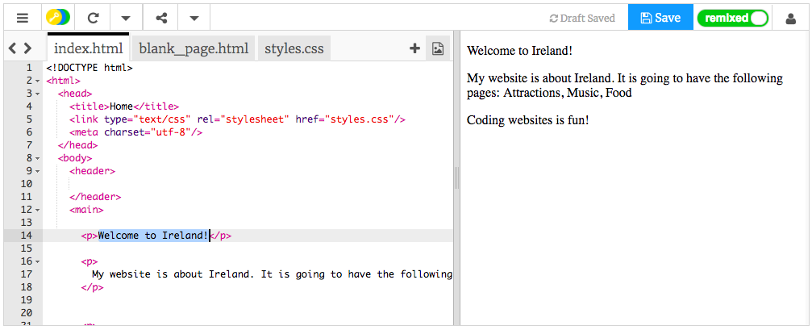

## Deine erste Webseite!

- Klicken Sie auf der linken Seite des **Code-Bedienfelds**auf die Registerkarte mit der Bezeichnung `index.html`.

- Finden Sie die Zeile, die `Willkommen in Irland sagt!` und ändern Sie es in Ihre eigene Nachricht - seien Sie vorsichtig **nicht** , um die Tags`<p>` am Anfang der Zeile und `</p>` am Ende der Zeile zu löschen. Sie sollten Ihr Webseiten-Update im rechten Fenster sehen.



- Ändern Sie nun in derselben Zeile die Werte `<p>` und `</p>` in `<h1>` und `</h1>`. Bemerken Sie eine Veränderung im Ergebnis auf der rechten Seite?

```html
  <h1>Willkommen in Irland!</h1>
```

## \--- Einsturz \---

## Titel: HTML und Tags erklärt

**HTML** ist der Code, der eine Webseite erstellt.

Die `.html` im Dateinamen teilt dem Browser mit, dass die Datei eine Webseite ist, so dass der Browser weiß suchen **- Tags** erzählen sie , was angezeigt werden soll . (Ein Browser ist das Programm, mit dem Sie Websites betrachten, zum Beispiel Chrome oder Firefox.)

HTML-Tags wie `<p>` und `</p>` definieren verschiedene Teile einer Seite, zum Beispiel Absätze, Überschriften oder den Körper. Die Teile werden alle **Elemente**. Betrachten Sie sie als Bausteine.

### Warum brauche ich zwei Tags?

Sie benötigen eine **öffnende** und eine **schließende** Markierung, um dem Browser mitzuteilen, wo die Elemente **** und **und**. Also für einen Absatz, die Öffnung `<p>` Etikett sagt "Hier kommt ein Text, den ich möchte, dass Sie als Absatz angezeigt werden." Das schließende `</p>` -Tag teilt dem Browser mit, wo der Absatz endet.

Alles zwischen den Tags `<body>` und `</body>` ist Ihre Webseite.

- Beachten Sie, wie der End - Tag **immer** hat einen Schrägstrich `/`.

\--- / einklappen \---

- Versuchen Sie, die Zahlen in Ihren **Überschrift** Tags zu ändern, um die verschiedenen Größen zu sehen, die sie Ihnen geben. Sie können von `<h1>` bis `<h6>`. Denken Sie daran, sowohl das öffnende als auch das schließende Tag zu ändern, damit sie übereinstimmen.

- Finden Sie den Code für den Absatz, der `sagt Meine Website ist über Irland.` und ändere es so, dass es so aussieht:

```html
  <p>
    <em>Meine Website</em> ist ungefähr <strong>Irland</strong>. 
    Es wird folgende Seiten haben: Attraktionen, Musik, Essen
  </p>
```

Können Sie herausfinden, was die Tags `<em> </em>` und `<strong> </strong>` tun?


\--- Herausforderung \---

## Herausforderung: Fügen Sie noch mehr eigenen Text hinzu

- Fügen Sie Ihrer Seite einen neuen Absatz oder eine neue Überschrift hinzu, indem Sie einige der Tags verwenden, die Sie kennengelernt haben.

\--- Hinweise \---

\--- Hinweis \--- Wenn Sie Text auf einer Seite platzieren möchten, müssen Sie ihn zwischen zwei Tags setzen, die Ihrem Browser mitteilen, wie er Ihren Text anzeigen soll. Zum Beispiel sagen die `<p> </p>` -Tags dem Browser, dass das, was dazwischen ist, ein neuer Absatz des Textes ist, und die `<h1> </h1>` -Tags sagen ihm, dass der Text dazwischen eine Überschrift ist.

\--- /Hinweis \---

\--- Hinweis \---

Der Code für Absätze sieht folgendermaßen aus:

```html
  <p>Dies ist ein Absatz des Textes.</p>

  <p>Dies ist ein weiterer Absatz.
  Alles zwischen einem Satz von p Tags wird zusammen in einer langen Zeile auf der Webseite angezeigt.</p>
```

\--- /Hinweis \---

\--- Hinweis \---

Der Code für Überschriften sieht folgendermaßen aus:

```html
  <h1>Dies ist eine Überschrift.</h1>
```

Überschriften werden normalerweise größer oder dicker als die Absätze angezeigt.

\--- /Hinweis \---

\--- / Hinweise \---

\--- /Herausforderung \---

Herzlichen Glückwunsch, Sie haben Ihre erste Webseite erstellt! Auf der nächsten Karte erfahren Sie, wie Sie steuern können, wie es aussieht.