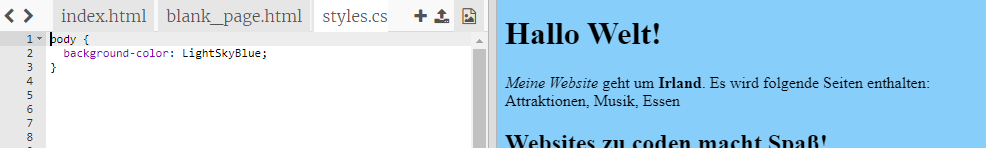
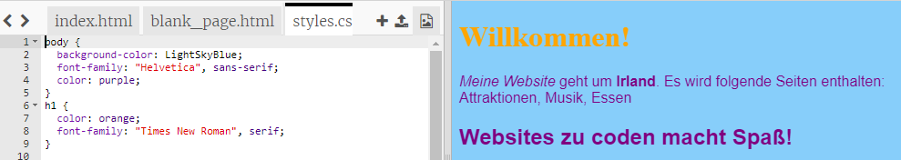

## Steuern, wie es aussieht

Der Code, der beschreibt, wie eine Website aussieht, heißt **CSS**.

- Sehen Sie sich die Registerkarten oben im Codebereich an und gehen Sie zur Datei `styles.css` indem Sie auf den Tab mit diesem Namen klicken. Die Datei enthält den folgenden Text:

```css
  Körper {Hintergrundfarbe: weiß; }
```

- Ändere die `weiße` Farbe zu `LightSkyBlue` und schau was passiert. Ihre Website sollte jetzt einen blauen Hintergrund haben! 



## \--- Einsturz \---

## Titel: Wie funktioniert es?

Wenn Sie sich den Anfang der Datei `index.html` ansehen, sehen Sie die folgende Zeile:

```html
  <link type="text/css" rel="stylesheet" href="styles.css"/>
```

Die obige Zeile weist den Browser an, nach einer speziellen Datei namens `styles.css`zu suchen. Diese spezielle Datei wird **Stylesheet**. Sie können eine Stylesheet-Datei an der `.css` in ihrem Namen erkennen.

Ein Stylesheet enthält **Regeln** für das Aussehen jedes Elements auf Ihrer Webseite.

Die geschweiften Klammern `{ }` und der Code dazwischen sind eine Menge von **CSS-Regeln**. Das Wort `Körper` bedeutet, dass die Regeln für alle `<body>` Elemente auf Ihrer Website gelten. Wir nennen das Bit vor den geschweiften Klammern eine **Auswahl**. In diesem Fall ist es der Selektor für die Körperelemente.

Jede Regel in den geschweiften Klammern besteht aus:

- A **Eigenschaft** auf der linken Seite, gefolgt von einem Doppelpunktsymbol `:`
- A **Wert** für die Eigenschaft auf der rechten Seite nach dem Doppelpunkt
- Ein Semikolon-Symbol `;` am Ende

\--- / einklappen \---

- Fügen Sie Regeln hinzu, um zu ändern, wie der Text aussieht. Fügen Sie zwei neue Zeilen in die geschweiften Klammern ein:

```css
  Körper {Hintergrundfarbe: LightSkyBlue; Schriftfamilie: "Helvetica", serifenlos; Farbe lila; }
```

Schau dir an, wie das die Webseite verändert hat.

Die Eigenschaft `Farbe` ist immer für Text. Hier legen Sie die Farbe für den gesamten Text in `Körper` Ihrer Webseite fest.

- Sie können auch separate Regeln für die Überschriften und Absätze definieren. Für `<h1>` Überschriften verwenden Sie den `h1` Selektor. Fügen Sie unter der schließenden geschweiften Klammer, die die CSS-Regel für den Textkörper enthält, den folgenden Code hinzu.

```css
  h1 {Farbe: orange; Schriftfamilie: "Times New Roman", Serif; }
```

Ihr Überschriftentext sollte jetzt orange sein, mit dem Absatz in lila wie zuvor.



Beachten Sie, dass die Buchstaben auch anders aussehen und eine andere Farbe haben? Dies liegt daran, dass Sie die **Schriftfamilie**geändert haben. Hier finden Sie weitere Schriftarten [](http://dojo.soy/web-font-families).

- Versuchen Sie, einen Satz Regeln für die `<h2>` Überschriften hinzuzufügen, indem Sie den `h2` Selektor verwenden.

- Warum nicht mit verschiedenen Farbkombinationen für Text und Hintergrund experimentieren? Es gibt viele Farben zur Verfügung. Finden Sie eine vollständige Liste von ihnen [hier](http://dojo.soy/web-color-names).