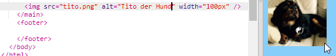
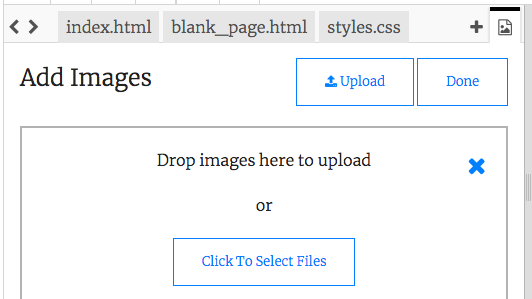

## Bilder hinzufügen

Fügen wir ein Bild hinzu!

- Klicke auf den Reiter `index.html`. Suche nach dem `</main>` -Tag und gib folgendes **in der Zeile darüber** ein: 

```html
    
```

So sollte das Ergebnis aussehen:



Beachte jedoch, dass dieses Tag zusätzliche Informationen enthält. Diese werden **Attribute** genannt.

- Finde das Codestück `width="100px"` und probiere verschiedene Zahlen aus, um herauszufinden, was dieses Attribut tut. Lösche dabei die Buchstaben `px` nicht!

## \--- collapse \---

## title: How the `img` tag works

Notice that the `` tag is different from the other tags you've used so far — there is no closing `</img>` tag. Instead, this tag is **self-closing**: it has `/>` at the end. This is because there is no 'start' and 'end' to an image element like there is for text on the page.

The tag contains **attributes** with extra information:

- Das `src`-Attribut teilt dem Browser mit, welche Datei er für das Bild verwenden soll. 
- Das `alt`-Attribut ist eine kurze Beschreibung, die der Browser anzeigt, wenn das Bild nicht angezeigt werden kann. 'alt' ist kurz für 'Alternative'. Dieser Text wird auch von einem Bildschirmleser verwendet, damit Sehbehinderte wissen, was das Bild darstellt.
- Das `width` Attribut teilt dem Browser mit, wie breit das Bild sein soll. `100px` bedeutet einhundert **Pixel**, das sind die winzigen Punkte, die das Bild auf deinem Bildschirm formen. Wenn du dieses Attribut nicht angibst, wird das Bild in seiner Originalgröße angezeigt.

\--- /collapse \---

Now that you know the code to put a picture on your website, you probably want to change the picture, right?

- Das erste, was du brauchst, ist natürlich ein Bild! Du kannst entweder ein Bild verwenden, das bereits auf deinem Computer ist, wie z.B. ein von dir erstelltes Foto. Du kannst aber auch einfach eines aus dem Internet einfügen.

[[[generic-get-picture-from-web]]]

**Note:** not all images you will find on the internet are free for anyone to use. If you download a picture, you should make sure it is one that you are allowed to use. Find out more about this here:

[[[images-permissions-to-use]]]

Once you have a picture, you can **upload** the file to Trinket:

- Klicke in Trinket auf das **Bild**-Symbol neben dem **+** Zeichen. 


This is where you can see the pictures that you are able to use on your website. You should see the picture of Tito, the CoderDojo dog.

- Klicke die **Add image** Schaltfläche und dann klicke **Upload**.

- Klicke auf die Schaltfläche **Click to select files** (Dateien auswählen). Finde und doppel-klicke auf deine Bilddatei in dem Fenster, das sich öffnet.

- Klicke **Done** (fertig).



Your picture will be uploaded and should be ready to use.

- Gehe zur Datei `index.html` und finde den `` Tag. Ändere den Text `tito.png` so, dass er exakt mit dem Namen der von dir ausgewählten Bilddatei übereinstimmt. Beachte, dass der Name möglicherweise auf `.jpg` anstelle von `.png` endet!

The text you just changed is the attribute called `src`, which tells the browser which file to display.

**Note:** the value you type for an attribute must have quotation marks `""` around it!

\--- challenge \---

## Challenge: change the alt text of the picture

- Suche das Attribut `alt` deines Bildelements und ändere den darin enthaltenen Text zu einer kurzen Beschreibung deines Bildes. 

\--- /challenge \---