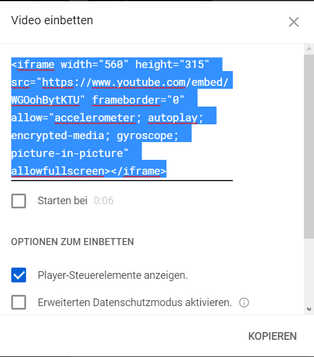
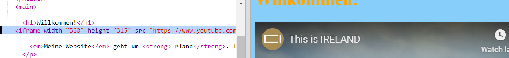
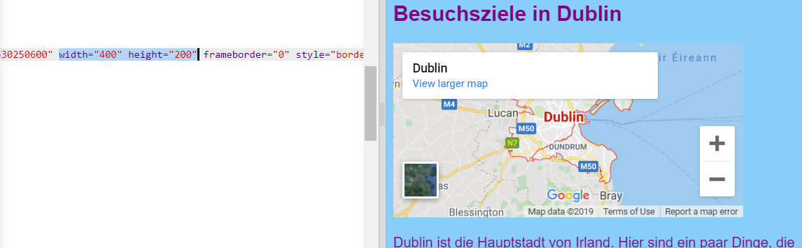

## Hinzufügen einer Karte oder eines Videos

YouTube bietet eine einfache Möglichkeit, Videos zu Ihrer Website hinzuzufügen. Das Hinzufügen von Elementen aus anderen Online-Quellen zu Ihrer Website wird auch **Einbetten**.

- Suchen Sie auf YouTube ein Video, das Sie auf Ihrer Website anzeigen möchten.

- Klicke auf die Schaltfläche **Teilen** unter dem Video. Wählen Sie die Option **Einbetten**.

Sie sehen ein Textfeld mit dem gesamten ausgewählten Text. Wenn Sie den Text versehentlich abwählen, können Sie ihn erneut auswählen, indem Sie darauf klicken und gleichzeitig die Tasten <kbd>Ctrl</kbd> (oder <kbd>cmd</kbd> auf einem Mac) und <kbd>A</kbd> drücken.

- Drücken Sie die Tastenkombination <kbd>Ctrl</kbd> (oder <kbd>cm</kbd> auf einem Mac) und <kbd>C</kbd> um den Text zu kopieren.

- Kehren Sie dann zum HTML-Code Ihrer Website zurück und klicken Sie an die Stelle, an der Sie das Video einfügen möchten, beispielsweise unter eine Überschrift oder einen Absatz. **Paste** der Code durch Drücken von <kbd>Ctrl</kbd> (oder <kbd>cmd</kbd> auf einem Mac) und <kbd>V</kbd> auf der Tastatur zur gleichen Zeit. Mach dir keine Sorgen über den Code, den du gerade eingefügt hast!

Sie sollten das Video auf Ihrer Webseite sehen.

Die gleiche Technik funktioniert auch für Google Maps. Probieren Sie es aus!

- Gehen Sie [hier](http://dojo.soy/google-maps) und suchen Sie nach einem Ort, den Sie auf Ihrer Website zeigen möchten. **Hinweis:** do **nicht** teilen persönliche Informationen wie Ihre Wohnadresse auf einer Website!

- Klicken Sie auf das Ergebnis und dann auf die Schaltfläche **Teilen** , kopieren Sie den Code und fügen Sie ihn wie oben beschrieben zu Ihrer Website hinzu. 

- Wenn Sie genau hinschauen, sollten Sie im eingefügten Code `Breite` und `Höhe` **Attribute**. Sie können ihre Werte ändern, um die Karte größer oder kleiner erscheinen zu lassen.

