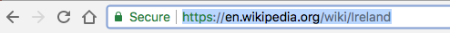
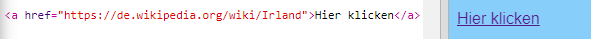

## Links erstellen

Auf dieser Karte erfährst du, wie du einen Link erstellst, der dich zu einer anderen Seite führt.

- Füge dem body-Abschnitt von `index.html` folgenden Code hinzu:

```html
  <a href="">Klicke hier</a>
```

Die `<a> </a>` Tags verwandeln alles, was sich dazwischen befindet, in einen Link.

- Klicke auf deinen Link, um zu sehen, was passiert. Es tut sich nichts, oder?

Das liegt daran, dass das `href` Attribut noch leer ist. Es muss die **URL** (Webadresse) der Seite enthalten, auf die du verlinken möchtest.

- Gehe zu Wikipedia und finde eine Seite über etwas auf Deiner Webseite. Ich benutze die Seite über Irland.

- Klicke in die Adressleiste und wähle den gesamten Text in i5 aus. Das ist die vollständige URL der Seite, auf der du dich befindest. Drücke die <kdb>Strg</kdb> (oder <kdb>cmd</kdb>) und <kdb>C</kdb> Tasten gleichzeitig, um es zu kopieren.
    
    

- In deinem trinket, klicke zwischen die Anführungszeichen nach `href=` und drücke die <kdb>Strg</kdb> (oder <kdb>cmd</kdb>) und <kdb>V</kdb> Tasten gleichzeitig, um die URL einzufügen, die du gerade kopiert hast. Dein Code sollte nun ungefähr so ​​aussehen:

```html
  <a href="https://de.wikipedia.org/wiki/Irland">Klicke hier</a>
```

Du hast gerade deinen ersten Link erstellt! Klicke darauf, um zu sehen, ob es jetzt funktioniert.



## \--- collapse \---

## title: Links zu anderen Webseiten

Trinket hat Probleme mit einigen Webadressen. Du kannst URLs von anderen Websites als Wikipedia ausprobieren aber möglicherweise werden sie nicht in deinem trinket funktionieren. Aber wenn du dein Projekt herunterlädst und die Dateien in einem Webbrowser anzeigen lässt, sollten die Links doch funktionieren.

\--- /collapse\---

- Versuche, ein Bild zwischen den `<a> </a>` Tags zu setzen, anstelle der Wörter `Klicke hier`, und zwar so:

```html
  <a href="https://en.wikipedia.org/wiki/Ireland">
     
  </a>
```

- Klicke auf dein Bild. Siehst du, dass es ein Link geworden ist?

Du kannst einen Link auch in andere Elemente deiner Webseite einfügen, z.B. in einen Absatz oder sogar in eine Liste. Hier ist ein Beispiel von einem Satz, der einen Link enthält:

```html
  <p>
  <a href="https://de.wikipedia.org/wiki/Irland">Klicke hier</a> um die Wikipedia Seite zu lesen!
  </p>
```

\--- challenge \---

## Herausforderung: Füge einen Link in eine Liste ein

- Schaue, ob du eine Liste erstellen kannst, die einen Link in einem der Listenelemente enthält.

\--- /challenge \---