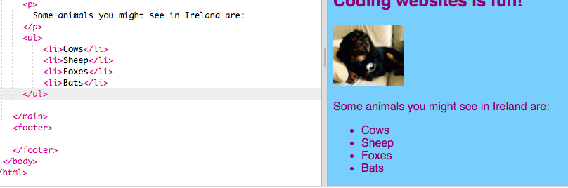

## Eine Liste machen

Jetzt lernst du, wie du eine Liste von Gegenständen, wie "Einhörner, Roboter, Katzen", in eine schönere Liste verwandelst, mit der du später coole Dinge tun kannst.

- Fügen Sie in der Datei `index.html` den folgenden Code direkt über der Zeile mit `</main>`:

```html
    <ul>
        <li>Kühe</li>
        <li>Schafe</li>
        <li>Füchse</li>
        <li>Fledermäuse</li>
    </ul>
```

Das Ergebnis sollte eine nette Liste wie folgt sein:



Beachten Sie, dass um jedes Element in der Liste ein separates Paar von `<li> </li>` -Tags besteht.

Dies ist eine Liste mit einigen Tieren, die Sie in Irland sehen können. Sie können die Elemente in der Liste in Dinge ändern, die für Ihre Website sinnvoll sind, und einen Absatz über der Liste hinzufügen, um zu beschreiben, was eine Liste von Ihnen ist, wenn Sie möchten!

Wie wäre es, wenn Sie eine nummerierte Liste haben wollten? Es ist fast das Gleiche, aber statt `<ul>`Sie `<ol>`. Eine nummerierte Liste wird auch als **Ordered-** Liste bezeichnet.

- Fügen Sie den folgenden Code unterhalb des Codes ein, den Sie gerade geschrieben haben - stellen Sie sicher, dass es **unter** das `</ul>` Tag!

```html
    <p>
        Meine Lieblingsdinge zum Essen und Trinken in Irland sind:
    </p>
    <ol>
        <li>Tee</li>
        <li>Crisp Sandwiches</li>
        <li>Würstchen</li>
    </ol>
```

So sollte es jetzt aussehen:


\--- Herausforderung \---

## Herausforderung: Fügen Sie Ihren Listen Stil hinzu

- Sehen Sie, ob Sie Ihrem Stylesheet **CSS-Regeln** hinzufügen können, um zu ändern, wie Ihre Listen aussehen.

\--- /Herausforderung \---