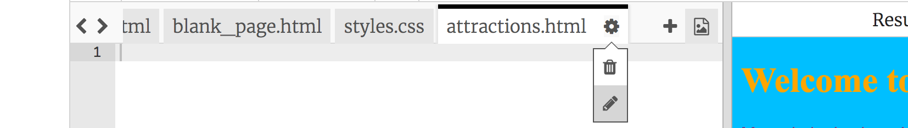

## Weitere Seiten hinzufügen

Diese Karte zeigt dir, wie du weitere Seiten zu deiner Website hinzufügen kannst.

- Klicke oben im Codebereich auf das **+** Symbol neben den Tabs und gib einen Namen für deine neue Datei ein. Er muss mit `.html` enden (einschließlich des Punkts!), damit der Browser weiß, dass es sich um eine Webseite handelt.


--- collapse ---
---
title: Eine Datei umbenennen oder löschen
---

Wenn du den Namen einer Datei ändern möchtest, klicke auf das Symbol **Zahnrad**-Symbol rechts neben dem Dateinamen und anschließend auf das **Bleistift**-Symbol. Gib den neuen Namen ein und drücke **Enter**. Du kannst eine Datei auch löschen, indem du auf das**Papierkorb** Symbol anstelle des **Bleistift** Symbols klickst. 

Du fragst dich vielleicht, warum du den Namen der Datei `index.html` nicht ändern kannst. `index.html` ist ein besonderer Name für die **Homepage** einer Website. Das ist die erste Seite, auf der du landest, wenn du eine Website besuchst. Wenn du auf die Startseite einer Website gehst, sucht der Browser nach der Datei mit dem Namen `index.html` und zeigt sie auf deinem Bildschirm an.

--- /collapse ---

- Finde die Datei `blank_page.html`, kopiere den gesamten Code darin und füge ihn in deine neue Datei ein. Da Du das Ganze kopieren möchtest, kannst Du irgendwo auf den Code klicken und die Tastenkombination <kbd>Strg</kbd> (oder <kbd>cmd</kbd>) und <kbd>A</kbd> drücken, um alles gleichzeitig auszuwählen.

- Ändere den Text zwischen den `<title> </title>` -Tags, damit Deine neue Seite einen passenden Titel hat. Trinket zeigt den Titel nicht an, aber Du kannst ihn oben im Browserfenster sehen, wenn Du Dein Projekt herunterlädst.


- Zwischen den `<main> </main>` -Tags in der neuen Datei verwende die Tags, die Du gelernt hast, um Dinge wie Seiten, Überschriften, Bilder und Listen zur Seite hinzuzufügen!

- Wiederhole die obigen Schritte für jede neue Seite, die Du hinzufügen möchtest.

Wenn zu viele Registerkarten für Trinket auf einmal angezeigt werden, kannst Du die Symbole **<** und **>** in der oberen linken Ecke der Registerkarten verwenden, um zwischen ihnen zu wechseln.


Jetzt musst Du Links erstellen, damit Du zu jeder Deiner neuen Seiten gelangen kannst! Lasse uns alle Links in eine Liste einfügen.

- Füge in der Datei `index.html` dem Textkörper (body) Deiner Webseite den folgenden Code hinzu:

```html
    <ul>
   <li><a href="index.html">Start</a></li>
   <li><a href="attractions.html">Attraktionen</a></li>
   <li><a href="music.html">Musik</a></li>
   <li><a href="food.html">Essen</a></li>
 </ul>
```

- Ändere den Wert des Attributs `href` für jeden Link (denke daran, das ist der Text in den Anführungszeichen), damit er genau mit dem Namen der einzelnen HTML-Dateien übereinstimmt, die Du erstellt hast.

- Ändere den Text zwischen den `<a> </a>` -Tags in passende Beschreibungen Deiner Seiten.

Jetzt kannst Du zu Deinen neuen Seiten navigieren!

