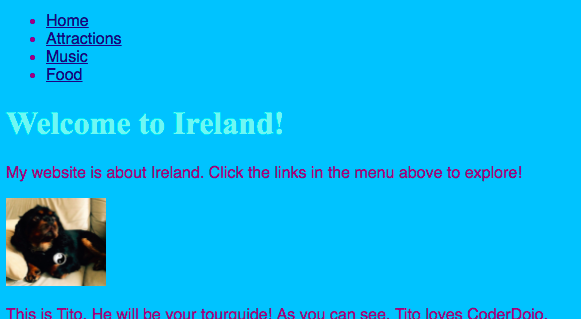

## Navigating your website

Many websites have a **navigation** menu to make it easy to get around the pages. Now that you've got a bunch of pages, a homepage, and a links to each page, let's move the list of links to a navigation section at the top of every page. 



- Find the code for your list of links that you created in the previous step.

- Just before the opening `<ul>` tag, press enter to create a new blank line, then on the new line type the following tag: `<nav>`. Trinket automatically adds in the closing tag for you, you can delete that for now.

- Just **after** the **closing** `</ul>` tag, press enter to go onto a new line, and type in the closing tag `</nav>`. 

- Now, select your entire `nav` section and list by clicking just before the opening `<nav>` tag and dragging the mouse all the way until just after the closing `</nav>` tag, so that all of the text including the opening and closing tags becomes highlighted. Make sure all of the **angle brackets** `<` and `>` at the start and end are highlighted too!


- You are going to **cut** this time instead of **copy**. Press and hold the **Ctrl** \(or **cmd**\) key and while holding it press the **X** key. The code will disappear but don't panic!

- At the top of the file, click in the space between the `<header> </header>` tags. Make sure you see the cursor flashing there. Now **paste** in the code by pressing **Ctrl** \(or **cmd**\) and **V** together as usual. The code should look something like this:
```html
    <header>
        <nav>
            <ul>
            <li><a href="index.html">Home</a></li>
            <li><a href="attractions.html">Attractions</a></li>
            <li><a href="music.html">Music</a></li>
            <li><a href="food.html">Food</a></li>
            </ul>
        </nav>
    </header>
```

--- collapse ---
---
title: Undo!
---

   If you make a mistake, you can **undo** it by pressing **Ctrl** \(or **cmd**\) and **Z** together. You can usually press it a few times to undo the last couple of changes. This is another handy shortcut that you can use in many programs!

--- /collapse ---

- Try out your links to make sure they are still working.

- Put the same code into each new file that you created. This will make the navigation menu appear at the top of every page on your website.

 --- hints ---

 --- hint ---
 Select the entire `nav` section like you did before, and press the **Ctrl** \(or **cmd**\) and **C** keys together to **copy** it. 
 
 Then, in each of your html files, click inside the `<header> </header>` section and **paste** the code exactly like you did above.
 --- /hint ---

 --- /hints ---

Now you will be able to click the links no matter which page you are on. 

