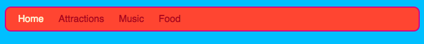
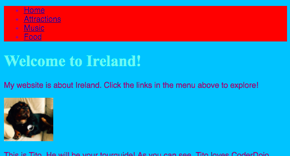
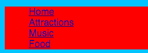
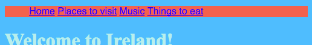
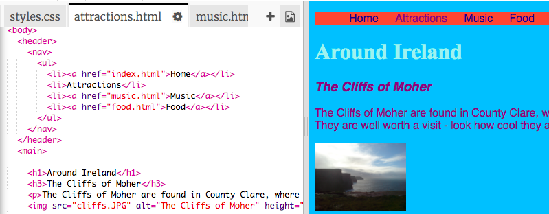

## Making a menu bar

On this card you will see how you can transform your navigation menu into a cool looking menu bar just by adding more CSS rules in the style sheet.



- Go to the style sheet file in the `styles.css` tab. Click **below** closing curly brace `}`, and press **Enter** to create a new blank line. Add the following CSS rule:

```css
    nav ul {
        background-color: tomato;
    }
```

Notice how you used two selectors instead of one? If you used the `ul` selector on its own, the rule would affect all unordered lists on your website. Adding the `nav` selector as well makes it only apply to lists that are in between `nav` tags.



Let's get rid of the bullet points. Those are the dots in front of each list item. 

- Add the following to the `styles.css` file. Again, type it on a new line after a `}` so it's not inside any other block of rules.

```css
    nav ul li {
        list-style-type: none;
    }
```

Notice this set of rules has three selectors: it selects all `li` elements that are in a `ul` list which is inside a `nav` section. Phew! 



Now let's make the list horizontal (across) instead of vertical (down). 

- Inside the new set of rules, add the following line: `display: inline;`.

 
 
- The menu items are now all squashed together, so let's also add the properties `margin-right` and `margin-left` to space them out a bit. The rules should look like this now:

```css
    nav ul li {
        list-style-type: none;
        display: inline;
        margin-right: 10px;
        margin-left: 10px;
    }
```
   
Remember: `10px` means ten pixels.

How about making the menu change to tell you which page you are on? This part won't be in the style sheet.

- Start with the homepage. Go to the `index.html` file. In the list, remove the link tags before and after the word `Home`, so that the list item for the homepage is just text in between `<li> </li>` tags, like this: `<li>Home</li>`.

- Now go to each of your other files, and do the same thing, each time removing the link tags for the page you are editing. So, for example, on the `music.html` file, I've removed the link tags in the `Music` list item:

```html
    <header>
        <nav>
            <ul>
            <li><a href="index.html">Home</a></li>
            <li><a href="attractions.html">Attractions</a></li>
            <li>Music</li>
            <li><a href="food.html">Food</a></li>
            </ul>
        </nav>
    </header>
```

- Explore your pages by clicking the links. See how the menu bar shows the page you're on as plain text instead of a link? 



On the next card you'll learn even more CSS tricks to make the menu bar look cool.
