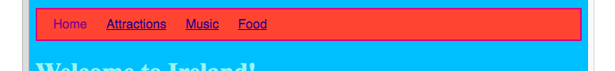
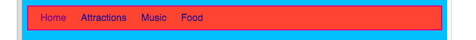

## Styling the menu bar

With CSS, the possibilities for making your menu bar look great are endless. 

- Move to the `styles.css` file again — the place where the cool stuff happens!

- Find your `nav ul` selector, and add more rules so that it looks like this:

```css
  nav ul {
    background-color: tomato;
    border-style: solid;
    border-color: MediumVioletRed;
    border-width: 2px;
    padding: 10px;
  }
```

The `padding` property adds space. Can you work out what each of the other properties do? Try experimenting with different colours and numbers of pixels.  



- To get rid of the underlining of the links, add the following code on a new line after the closing curly brace `}` for the `nav ul li` rules. You could put it after any `}`, but it's a good idea to keep related stuff together so it's easier to find!

```css
  nav ul li a {
      text-decoration: none;
  }
```
   
The above rule applies to links `<a>` inside list items `<li>` in an unordered list `<ul>` inside a navigation section `<nav>`. Wow, that's four selectors! 



Remember how you removed the link tags from some list items in the `<nav>` so you can easily see what page you're on? Why not also change the text colour of those navigation list items which are not links! 

- Find your `nav ul li` selector, and **inside** the curly braces add the line:

```css
  color: PapayaWhip;
```

You can choose any colour you like! 
  
You can add the `color` property to the `nav ul li a` rule as well if you want the menu links to be a different colour from other links on your website.

- How about some rounded corners for your menu? Try adding the following code to the `nav ul` rule to see what happens: `border-radius: 10px;`.
  
The `border-radius` property is a really easy way to make anything look cooler! 


--- challenge ---

## Challenge: make your pictures have rounded corners

- In your style sheet, create a new set of rules for pictures using the `img` selector, and add in a `border-radius` rule there.

--- /challenge ---
