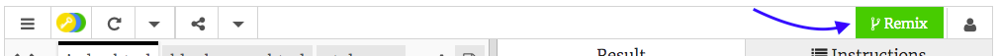

## Getting set up

- Go to [the starter trinket](http://dojo.soy/html-b-start). You will see a box containing an example website project. On the right-hand side is the website, and on the left-hand side is the code that makes the website.

--- collapse ---
---
title: I have a Trinket account
---

- Click the **Remix** button at the top right of the project. If you are not signed in, you will be prompted to do so. Once you've signed in, you'll  need to click  **Remix** again. Clicking this button creates a copy of the project for you to work with. 

It should say **remixed** after you click it:

--- /collapse ---

--- collapse ---
---
title: I don't have a Trinket account
---

You can save your work by using one of the options in the **Share** menu. You will get a link that you can either save somewhere, for example in a document, or send to someone via email.
**Note:** each time you make a change, you will get a new link.

If you want to create an account on Trinket, follow the steps below. This will allow you to access your work easily from any computer, and to **remix** projects somebody else has shared with you. Remixing means you will save a copy of a project so you can make your own changes to it.

- Go to [the Trinket website](http://dojo.soy/trinket) and click **Sign Up For Your Free Account**. You will need an email address to sign up. 

- Enter your email address and choose a password, or ask somebody to do this for you.

- You can now access all your saved or remixed projects by clicking on your username and going to **My Trinkets**.

--- /collapse ---

Let's start coding!

