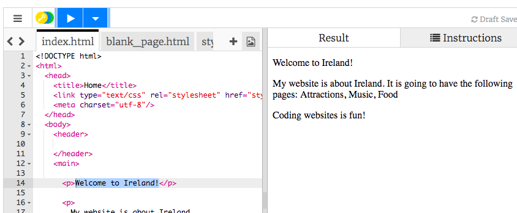

## Creating a web page

- In the left-hand panel, the **code panel**, click on the tab that says "index.html".

- Find the line that says "Welcome to Ireland!" and change it to your own home country or town, being careful not to delete the text `<p>` at the start of the line and `</p>` at the end of the line. Then click on the button that says "Click To Run". This is the Run button. You will see your web page updated in the right-hand panel. 

- Now on the same line, change the `<p>` and `</p>` to `<h1>` and `</h1>`, and click Run. What happens?
  ```html
    <h1>Welcome to Ireland!</h1>
  ```

- When you want to put text on a page, you need to put it in between two **tags** that tell your browser how to display your text. For example, the `<p>` tag tells the browser it is a paragraph of text. The `<h1>` tag tells it that the text is a heading.

   A **browser** is the program you use to look at websites, for example Chrome or Firefox.

   The **.html** in the filename tells the browser that the file is a web page, so it looks for the tags telling it what to display. **HTML** is the code that makes a web page.

- Why do you need two tags? You have an **opening** and a **closing** tag to tell the browser where things start and end. So for a paragraph, the opening `<p>` tag says "here comes some text that I want you to display as a paragraph". The closing `</p>` tag tells the browser where the paragraph ends. Everything in between the `<body>` and `</body>` tags is your web page. 
  Notice how the **closing**tag always has a forward slash, `/`.
  
  The tags define different pieces of a page, for example paragraphs and headings, or the body; these pieces are all called **elements**. Think of them as building blocks.

- Try changing the `p` to `h2` in the last paragraph, the one that says "Coding websites is fun!" Remember to change it in both the **opening** `<p>` and the **closing** `</p>` tag.

- Find the `<title>` and `</title>` tags and change the text in between them to "Home". Then click the run button. 

- Find the code for the paragraph that says "My website is about Ireland" and change it so that it looks like this:
   ```html
      <p>
         <em>My website</em> is about <strong>Ireland</strong>. 
         It is going to have the following pages: Attractions, Music, Food
      </p>
  ```
  * Can you work out what the `<em> </em>` and `<strong> </strong>` tags do? Note: "em" is short for "emphasis".

- Click the blue Save button at the top right to save your changes.

- So a web page is just made up of text, with tags to control it!

  You have `p` tags for paragraphs and `h` tags for headings. 
  
  Try adding some more headings, changing the numbers in your tags to see the different sizes you get! They can go from `<h1>` all the way up to `<h6>`. Add some more text in between new `<p> </p>` tags too if you want!


