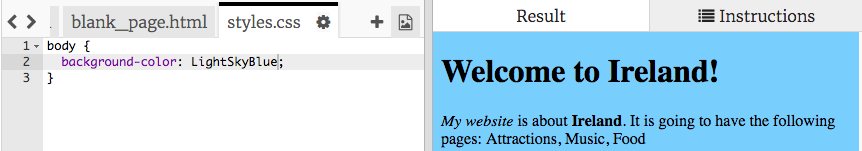

## Controlling how it looks

The code that describes what a website looks like is called **CSS**.

- Look at the tabs in the code panel and go to the file **styles.css** by clicking on the tab with that name.
The file contains the following text:
```css
  body {
      background-color: white;
  }
```

- Change the colour to `LightSkyBlue`, and see what happens. Your website should now have a blue background! 



--- collapse ---
---
title: How does it work?
---

If you look at the top of the **index.html** file, you will see the following line:
```html
<link type="text/css" rel="stylesheet" href="styles.css"/>
```

The above line tells the browser to look for a special file named styles.css. This special file is called a **stylesheet**. You can recognise a stylesheet file by the **.css** in its name. 
  
A stylesheet contains rules for what each element on your page should look like.

The curly braces `{ }` and the text in between them is a set of **CSS rules**. The word `body` means that the rules are for all the `<body>` elements on your website. We call the bit outside the curly braces a **selector**. So in this case, it is the **selector** for the **body** elements.

Each rule inside the curly braces is made up of 
  - a **property** on the left, followed by a `:` symbol \(**colon**\)
  - a **value** for the property, on the right hand side after the colon
  - a `;` symbol \(**semi-colon**\) at the end
   

--- /collapse ---

- Lets add rules to change how the text looks. Add two new lines inside the curly braces like this:

```css
  body {
    background-color: LightSkyBlue;
    font-family: "Helvetica", sans-serif;
    color: purple;
  }
```

Look at how it changed the web page. 

The `color` property is always for text. Here, you are setting the colour of all text in the `body` of your web page.

- You can also write separate rules for the headings and the paragraphs. For `<h1>` headings, you use the `h1` **selector**. Add the following code to the styles.css file, below the closing curly brace.

```css
  h1 {
    color: orange;
    font-family: "Times New Roman", serif;
  }
```
Your heading should be orange now, with the paragraph purple as before. 


Notice how the letters also look different as well as being a different colour? This is because you changed the **font family**. You can see some more fonts at [dojo.soy/font-families](http://dojo.soy/web-font-families)

- Try adding a set of rules for the `<h2>` headings, using the `h2` selector. 

- Why not experiment with different colour combinations for the text and background? There are lots of colours available to use. For a full list of them, go to [dojo.soy/web-color-names](http://dojo.soy/web-color-names)


