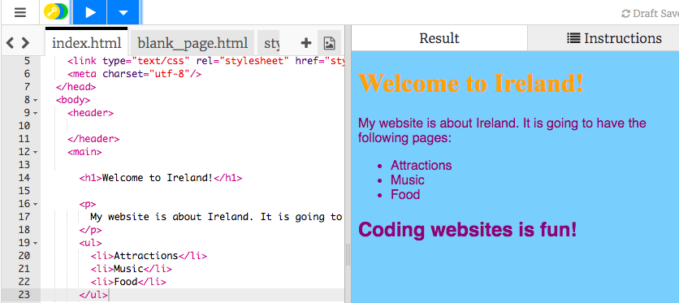
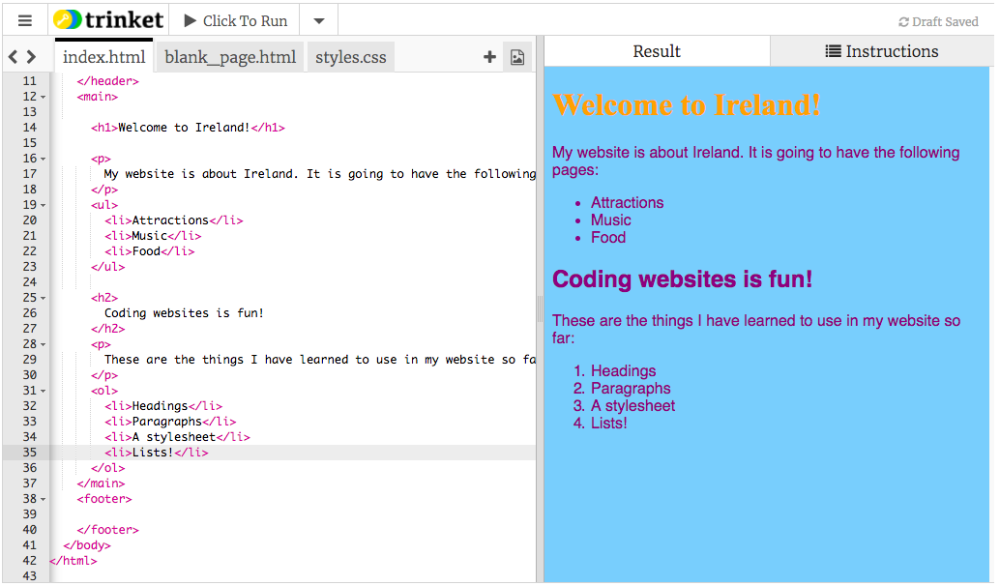

## Making a list

- When writing a list, wouldn't it be nice if the text looked more like a proper list? Well, there are html tags that do just that! Go back to the tab named index.html and change the paragraph code so that it looks like this:

    ```html
    <p>
        My website is about Ireland. It is going to have the following pages:
    </p>
    <ul>
        <li>Attractions</li>
        <li>Music</li>
        <li>Food</li>
    </ul>
    ```


- Click Run. See how the text got put into a nice list? 

  

- The `<ul> </ul>` tags go around the whole list, and they turn it into the nice looking list you now have. "ul" stands for **unordered list**. This means a list with no numbers. Each thing in the list must be in between `<li> </li>` tags. "li" stands for **list item**. 

    Change the text in the list items to some pages that you would like to have in your website. Your website can be about anything you want, it doesn't have to be about your home country!

- How about if you wanted a numbered list? It's almost the same, but instead of `ul`, you use `ol`, which stands for **ordered list**. Add the following code just above the line with the closing `</main>` tag:
   ```html
   <p>
      These are the things I have learned to use in my website so far:
   </p>
   <ol>
      <li>Headings</li>
      <li>Paragraphs</li>
      <li>A stylesheet</li>
      <li>Lists!</li>
   </ol>
   ```
- Click Run. Here's what it should look like now 

    


