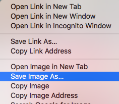

## Adding pictures

Let's add a picture!

- Go to the tab named index.html. Find the `</main>` tag and type the following above it: 
    ```html
    
    ```
    Here's what the result should look like:
    
   

Notice that this tag has extra bits of information inside it. They are called **attributes**.

- Find the bit of code that says `width="100px"` and try experimenting with different numbers to see if you can figure out what this **attribute** does. Don't delete the letters `px`!

--- collapse ---

---
title: How the img tag works
---

Notice that the `` tag is different from the other tags you've used so far: 

- There is no closing `</img>` tag. Instead it is **self closing**: the opening tag has `/>` at the end. This is because there is no "start" and "end" like there is when you are putting text on the page. 

- The tag contains extra pieces of information inside it called **attributes**. 
    - The `src` attribute tells the browser what file to use for the picture. 
    - The `alt` attribute is a short description that the browser will show if it cannot display the picture. It also helps people using a screen reader to know what the picture is.
    - The `width` attribute tells the browser how wide to make the picture. `100px` means one hundred **pixels**, the teeny-tiny dots that make up your screen. If you don't include this attribute, the picture will be displayed in its original size.

--- /collapse ---

Now that you know the code to put a picture on your website, you probably want to change the picture, right?

- The first thing you will need is a picture! You can either use one you've already got on your computer, such as a photograph you took, or you can get one from the internet.

--- collapse ---

---
title: Getting pictures from the internet
---

- Search for **images** of the thing you want a picture of.

- When you find a picture that you like, click to open it up full size.

- Then, **right click** the picture and select "Save Image As..." \(**not** "Save Link As..."\).


   

- Type a short name in the box provided. 

- Before you click "Save", make a note of which folder it will be saved into; it might be the Downloads folder. You will need to remember this to find the picture later! You can select a different folder if you wish. Finally, click "Save"


--- /collapse ---

Once you have a picture, you will **upload** the file to Trinket: 

- In your Trinket, click on the image icon next to the **+** sign. This is where you can see the pictures that can be used on your website. You should see the picture of Tito the CoderDojo dog.

- Click the button "Add Image" and then click "Upload". 

- Click on the button "Click To Select Files". Find your picture and double click on it. 

- Click "Done".

    

Your picture is uploaded and ready to use!

- Go to the file index.html and find the `` tag. Change the text `tito.png` so that it exactly matches the name of the file with your picture. Note that it might end in `.jpg` instead of `.png`!

The text you just changed is the **attribute** called `src`. It tells the browser what file to display.

_Important:_ The value you type for an **attribute** must have quotation marks around it!

### Challenge!
- Find the `alt` **attribute** and change the text in it to a short description of your picture. 


