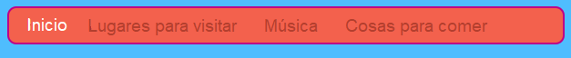
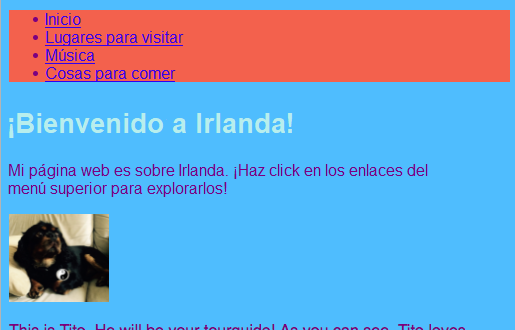
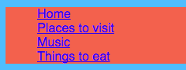
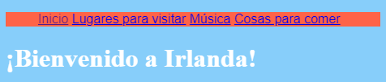
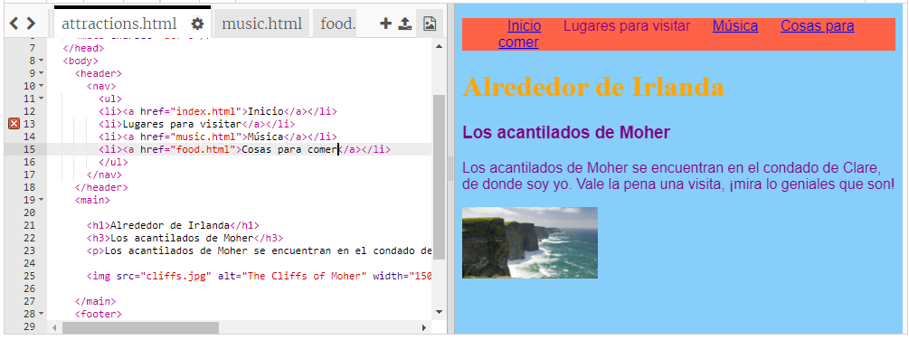

## Haciendo una barra de menú

En esta tarjeta, verás cómo puedes transformar tu menú de navegación en una barra de menú atractiva, simplemente agregando más reglas CSS en la hoja de estilo.



- Ve al archivo de hoja de estilo en la pestaña `styles.css`. Haz clic **debajo de** una llave de cierre `}` y presiona **Enter** para crear una nueva línea en blanco. Agrega la siguiente regla CSS:

```css
    nav ul {
        background-color: tomato;
    }
```

¿Te das cuenta de cómo usaste dos selectores en lugar de uno? Si usaste el selector `ul` por si solo, la regla afectaría a todas las listas desordenadas de tu página web. Agregar el selector `nav` también hace que solo se aplique a las listas que se encuentran entre las etiquetas `nav`.



Vamos a deshacernos de las viñetas. Son los puntos delante de cada elemento de la lista.

- Agrega lo siguiente al archivo `styles.css`. Nuevamente, escríbelo en una nueva línea después de un `}` para que no quede dentro de ningún otro bloque de reglas.

```css
    nav ul li {
        list-style-type: none;
    }
```

Observa que este conjunto de reglas tiene tres selectores: selecciona todos los elementos `li` que están en una lista `ul` la cual está dentro de una sección `nav`. ¡Uf!



Ahora hagamos la lista horizontal (cruzada) en lugar de vertical (abajo).

- Dentro de la nueva regla CSS que acabas de crear, agrega la siguiente línea: `display: inline;`.



- Los elementos del menú ahora están todos juntos, así que agreguemos también las propiedades (margen derecho) `margin-right` y (margen izquierdo) `margin-left` para separarlas un poco. El bloque de código CSS debería verse así ahora:

```css
    nav ul li {
        list-style-type: none;
        display: inline;
        margin-right: 10px;
        margin-left: 10px;
    }
```

Recuerda: `10px` significa diez píxeles.

¿Qué te parece hacer que el menú cambie para decirte en qué página estás? Esta parte no estará en la hoja de estilo.

- Comienza con la página de inicio. Ve al archivo `index.html`. En la lista de enlaces de menú, elimina las etiquetas de enlace antes y después de la palabra `Inicio`, de modo que el elemento de la lista para la página de inicio sea solo texto entre las etiquetas `<li> </li>`, como esta: `<li>Inicio</li>`.

- Ahora ve a cada uno de tus otros archivos y haz lo mismo, cada vez que elimines las etiquetas de enlace de la página que estás editando. Entonces, por ejemplo, en el archivo `music.html`, elimina las etiquetas de enlace en el elemento de la lista `Música`:

```html
    <header>
        <nav>
            <ul>
            <li><a href="index.html">Inicio</a></li>
            <li><a href="attractions.html">Lugares para visitar</a></li>
            <li>Música</li>
            <li><a href="food.html">Cosas para comer</a></li>
            </ul>
        </nav>
    </header>
```

- Explora tus páginas haciendo clic en los enlaces. ¿Ves cómo la barra de menú muestra la página en la que estás como texto sin formato en lugar de un enlace? 



En la siguiente tarjeta, aprenderás aún más trucos de CSS para que la barra de menú se vea increíble.