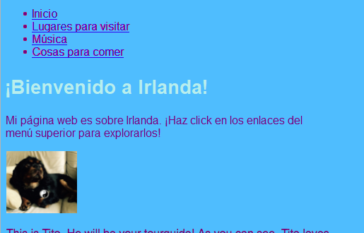
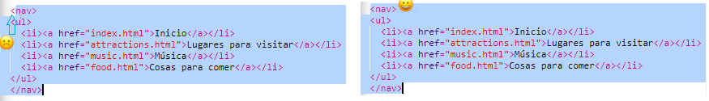

## Navegando por su sitio web

Muchos sitios web tienen un menú de **navegación** para ayudar a los visitantes a moverse entre páginas. Ahora que tiene un grupo de páginas, una página de inicio y enlaces a cada página, llevemos la lista de enlaces a una sección de navegación en la parte superior de cada página.



- Busque el código de su lista de enlaces que creó en el paso anterior.

- Justo antes de la etiqueta de apertura `<ul>` , presione **Ingrese** para crear una nueva línea en blanco, luego en la nueva línea escriba la siguiente etiqueta: `<nav>`. Trinket agrega automáticamente la etiqueta de cierre inmediatamente después, pero puede eliminarla; no está en el lugar correcto.

- Simplemente **después de** la etiqueta de cierre `</ul>` , presione **Ingrese** para crear una nueva línea en blanco, y escriba allí la etiqueta de cierre `</nav>`.

- Ahora seleccione toda su sección y lista `<nav>` haciendo clic justo antes de la etiqueta de apertura `<nav>` y arrastrando el mouse hasta justo después de la etiqueta de cierre `</nav>` , para que todo el texto incluya las etiquetas de apertura y cierre se resalta. ¡Asegúrese de que todos los **corchetes angulares** `<` y `>` al inicio y al final estén resaltados también!



- Va a **cortar** esta vez en lugar de copiar. Mantenga presionada la tecla <kbd>Ctrl</kbd> (o <kbd>cmd</kbd>), y mientras lo mantiene presionado, presione la tecla <kbd>X</kbd>. El código resaltado desaparecerá, ¡pero no se preocupe!

- En la parte superior del archivo, haz clic en el espacio entre las etiquetas `<header> </header>`. Asegúrese de ver el cursor parpadeando allí. Ahora pegue el código presionando <kbd>Ctrl</kbd> (o <kbd>cmd</kbd>) y <kbd>V</kbd> como de costumbre. El código debería verse más o menos así:

```html
    <header>
        <nav>
            <ul>
            <li><a href="index.html">Inicio</a></li>
            <li><a href="attractions.html">Lugares para visitar</a></li>
            <li><a href="music.html">Música</a></li>
            <li><a href="food.html">Cosas para comer</a></li>
            </ul>
        </nav>
    </header>
```

## \--- colapso \---

## título: ¡Deshacer!

Si comete un error, puede **deshacer** pulsando <kbd>Ctrl</kbd> (o <kbd>cmd</kbd>) y <kbd>Z</kbd> juntos. Por lo general, puede presionar esta combinación de teclas varias veces para deshacer los últimos cambios. Este es otro práctico atajo de teclado que puedes usar en muchos programas.

\--- /colapso \---

- Pruebe sus enlaces para asegurarse de que sigan funcionando.

\--- desafío \---

## Desafío: menús de navegación para todas las páginas

- Coloque esta sección de código en la sección de encabezado de cada archivo HTML que haya creado. Esto hará que el menú de navegación aparezca en la parte superior de cada página en su sitio web.
    
    \--- consejos \---
    
    \--- pista \--- Seleccione toda la sección `<nav>` como lo hizo antes, y presione las <kbd>teclas Ctrl</kbd> (o <kbd>cmd</kbd>) y <kbd>C</kbd> para copiarlas.

Luego, en cada uno de sus archivos `.html` , haga clic dentro de la sección `<header> </header>` y pegue el código exactamente como lo hizo antes. \--- /insinuación \---

\--- / consejos \---

Ahora podrá hacer clic en los enlaces sin importar en qué página esté.

\--- / desafío \---