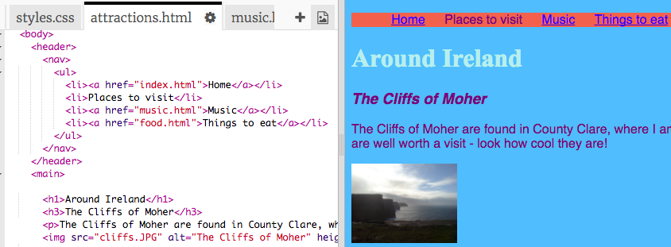

## Haciendo una barra de menú

En esta tarjeta, verá cómo puede transformar su menú de navegación en una barra de menú atractiva, simplemente agregando más reglas CSS en la hoja de estilo.


- Vaya al archivo de hoja de estilo en la pestaña `styles.css`. Haga clic en **debajo de** una llave de cierre `}`y presione **Ingrese** para crear una nueva línea en blanco. Agregue la siguiente regla CSS:

```css
    nav ul {
        color de fondo: tomate;
}
```

¿Te das cuenta de cómo usaste dos selectores en lugar de uno? Si utilizó el selector `ul` por sí solo, la regla afectaría a todas las listas desordenadas en su sitio web. Agregar el selector `nav` también hace que solo se aplique a las listas que se encuentran entre las etiquetas `nav`.


Vamos a deshacernos de las viñetas. Esos son los puntos delante de cada elemento de la lista.

- Agregue lo siguiente al archivo `styles.css`. Nuevamente, escríbalo en una nueva línea después de un `}` para que no esté dentro de ningún otro bloque de reglas.

```css
    nav ul li {
        tipo-estilo-lista: ninguno;
}
```

Observe que este conjunto de reglas tiene tres selectores: selecciona todos los elementos `li` que están en una lista `ul` que está dentro de una sección `nav`. ¡Uf!


Ahora hagamos la lista horizontal (cruzada) en lugar de vertical (abajo).

- Dentro de la nueva regla CSS que acaba de crear, agregue la siguiente línea: `display: inline;`


- Los elementos del menú ahora están todos juntos, así que también agreguemos las propiedades `margin-right` y `margin-left` para espaciarlas un poco. El bloque de código CSS debería verse así ahora:

```css
    nav ul li {
        tipo-estilo-lista: ninguno;
        pantalla: en línea;
        margen derecho: 10px;
        margen izquierdo: 10px;
}
```

Recuerde: `10px` significa diez píxeles.

¿Qué te parece hacer que el menú cambie para decirte en qué página estás? Esta parte no estará en la hoja de estilo.

- Comience con la página de inicio. Vaya al archivo `index.html`. En la lista de enlaces de menú, elimine las etiquetas de enlace antes y después de la palabra `Inicio`, de modo que el elemento de la lista para la página de inicio sea solo texto entre `<li> </li>` etiquetas, de esta manera: `<li>Inicio</li>`.

- Ahora vaya a cada uno de sus otros archivos y haga lo mismo, cada vez que elimine las etiquetas de enlace de la página que está editando. Entonces, por ejemplo, en el archivo `music.html` , eliminé las etiquetas de enlace en el elemento de la lista `Music`:

```html
    <header>
        <nav>
            <ul>
            <li><a href="index.html">Hogar</a></li>
            <li><a href="attractions.html">Lugares para visitar</a></li>
            <li>Música</li>
            <li><a href="food.html">Cosas para comer</a></li>
            </ul>
        </nav>
    </header>
```

- Explore sus páginas haciendo clic en los enlaces. ¿Ves cómo la barra de menú muestra la página en la que estás como texto sin formato en lugar de un enlace? 



En la siguiente tarjeta, aprenderá aún más trucos de CSS para que la barra de menú se vea increíble.