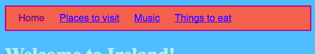
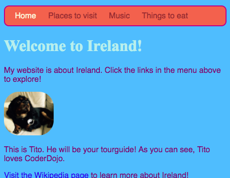

## Dando estilo a la barra de menú

Con CSS, las posibilidades de hacer que tu barra de menú se vea genial son infinitas.

- Vuelve al archivo `styles.css` nuevamente, ¡el lugar donde ocurren las cosas geniales!

- Busca tu selector `nav ul` y agrega más reglas para que se vea así:

```css
  nav ul {
    background-color: tomato;
    border-style: solid;
    border-color: MediumVioletRed;
    border-width: 2px;
    padding: 10px;
  }
```

La propiedad `padding` agrega espacio. ¿Puedes averiguar qué es lo que hace cada una de las otras propiedades? Intenta experimentar con diferentes colores y números de píxeles.



- Para deshacerte del subrayado de los enlaces, agrega el siguiente código en una línea nueva después del cierre de llaves `}` para las reglas `nav ul li`. Puedes ponerlo después de cualquier `}`, pero es una buena idea mantener juntas las cosas relacionadas. Así, ¡son más fáciles de encontrar!

```css
  nav ul li a {
      text-decoration: none;
}
```

La regla anterior se aplica a los enlaces `<a>` dentro de los elementos de la lista `<li>` en una lista desordenada `<ul>` dentro de una sección de navegación `<nav>`. ¡Guau, eso son cuatro selectores!


¿Recuerdas cómo eliminaste las etiquetas de enlace de algunos elementos de la lista en `<nav>` para que pudieras ver fácilmente en qué página estás? ¡Por qué no cambiar también el color del texto de esos elementos de la lista de navegación que no son enlaces!

- Encuentra tu selector `nav ul li`, y **dentro de** las llaves agrega la línea:

```css
  color: PapayaWhip;
```

¡Puedes elegir el color que quieras!

También puedes agregar la propiedad `color` a la regla `nav ul li` si deseas que los enlaces del menú sean de un color diferente al de otros enlaces en tu página web.

- ¿Qué tal algunas esquinas redondeadas para tu menú? Intenta agregar el siguiente código a la regla `nav ul` para ver qué sucede: `border-radius: 10px;`.

¡La propiedad `border-radius` es una manera realmente fácil de hacer que todo se vea mejor!



\--- challenge \---

## Desafío: haz que tus imágenes tengan esquinas redondeadas

- En tu hoja de estilo, crea un nuevo conjunto de reglas para imágenes usando el selector `img`, y agrega allí una regla `border-radius`.

\--- /challenge \---