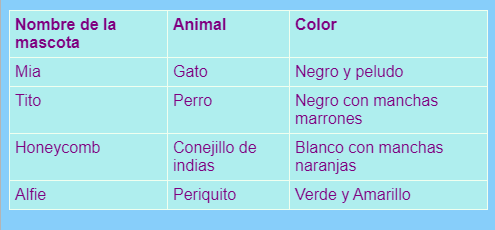

## Agregar una tabla

A veces puede ser útil mostrar información en una tabla. Por ejemplo, es posible que desee incluir información de miembros en un sitio web para un club o escuela deportiva local o información sobre sus diez canciones favoritas.

Una tabla es una cuadrícula compuesta por **filas** y **columnas**. La mayoría de las tablas también incluyen títulos en la parte superior de cada columna, llamados el encabezado ****. Aquí hay un ejemplo:



- Vaya al archivo `page_with_table.html`. Allí verá un montón de código entre `<table> </table>` etiquetas.

- Seleccione todo el código desde el comienzo de la etiqueta `<table>` hasta el final de la etiqueta de cierre `</table>` y cópielo. Luego vaya a uno de sus archivos donde le gustaría poner una mesa y pegue el código.

Por el momento su mesa está vacía.

- ¡Lánzate a llenar tu mesa con lo que quieras! Simplemente coloque texto entre las etiquetas `<td> </td>` y entre las `<th> </th>` etiquetas. Puede agregar más etiquetas si las necesita.

## \--- colapso \---

## title: Código de ejemplo

El código HTML para la tabla que se muestra arriba se ve así:

```html
  <table>
    <tr>
      <th>Nombre de la mascota</th>
      <th>Animal</th>
      <th>Color</th>
    </tr>
    <tr>
      <td>Mia</td>
      <td>Gato</td>
      <td>Negro y esponjoso</td>
    </tr>
    <tr>
      <td>Tito</td>
      <td>Perro</td>
      <td>Negro con parches marrones</td>
    </tr>
    <tr>
      <td>Panal</td>
      <td>Conejillo de Indias</td>
      <td>Blanco con manchas anaranjadas</td>
    </tr>
    <tr>
      <td>Alfie</td>
      <td>Budgie</td>
      <td>Verde y amarillo</td>
    </tr>
  </table>
```

\--- /colapso \---

Para agregar otra **fila**, agregue otro conjunto de `<tr> </tr>` etiquetas. Entre ellos, colocas la misma cantidad de **datos** elementos con `<td> </td>` etiquetas que en las otras filas.

Para agregar otra **columna**, agregue un elemento extra de **datos** con un conjunto de `<td> </td>` etiquetas a **cada** filas. También agregue un elemento adicional de **encabezado** a la primera fila, usando `<th> </th>` etiquetas.

## \--- colapso \---

## título: ¿Cómo funciona?

Echemos un vistazo a todas esas etiquetas. Es un poco como el código de una lista (recuerda `<ul>` y `<ol>`) pero con más niveles.

Cada par de etiquetas `<tr> </tr>` es una fila, por lo que todo lo que se encuentre entre ellas se mostrará en una línea.

La primera fila contiene `<th> </th>` etiquetas. Estos se utilizan para los encabezados, por lo que los títulos de columna se interponen entre ellos. Hay un par para cada columna que tienes en tu mesa.

Las etiquetas `<td> </td>` definen lo que se llama datos de tabla, y eso es lo que sucede en todas las otras filas. Son similares a las etiquetas de elementos de lista `<li> </li>`: todo lo que hay entre ellos es un elemento de la fila de la tabla.

\--- /colapso \---

- Si mira al final del archivo `styles.css` , verá el código CSS que describe cómo debería verse la tabla. ¡No tienes que entender todo! Pero puede experimentar cambiando el texto, el borde y los colores de fondo para diseñar su propio estilo.

```css
  table, th, td {border: 1px solid HoneyDew; border-collapse: colapso; } tr {background-color: PaleTurquoise; } th, td {vertical-align: top; relleno: 5px; text-align: izquierda; } th {color: púrpura; } td {color: púrpura; }
```

Observe cómo algunos de los selectores usan comas, por ejemplo `table, th, td`? Esa es una lista **de selectores**: significa que se aplica a todos los elementos `<th>` y los `<td>` elementos. ¡Guarda escribiendo el mismo conjunto de reglas para cada selector!