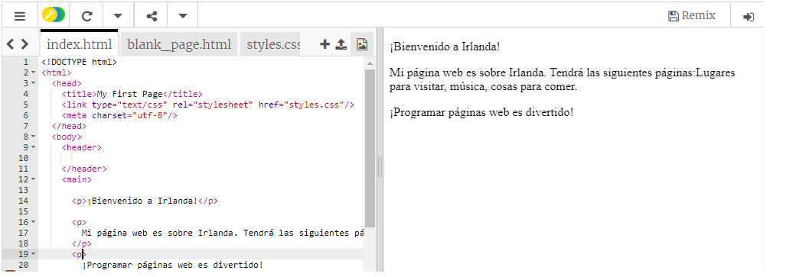

## Preparándote

- Ve al [comienzo de trinket](http://dojo.soy/html-b-start). Verás un cuadro que contiene un proyecto de la página web de ejemplo. En el lado derecho está la página web, y en el lado izquierdo está el código que crea la página web. 

## \--- collapse \---

## title: tengo una cuenta Trinket

- Haz clic en el botón **Remix** en la parte superior derecha del proyecto. Si no has iniciado sesión, te va a pedir que lo hagas. Una vez que hayas iniciado sesión, deberás hacer clic en **Remix** nuevamente. Al hacer clic en este botón, se crea una copia del proyecto para que puedas trabajar con él. 

Debería decir **remixed** después de hacer clic en él:

\--- /collapse \---

## \--- collapse \---

## title: no tengo una cuenta Trinket

Puedes guardar tu trabajo utilizando una de las opciones en el menú **Compartir**. Recibirás un enlace que puedes guardar en algún lugar, por ejemplo en un documento, o enviar a alguien por correo electrónico. **Nota:** cada vez que realices un cambio, obtendrás un nuevo enlace.

Si deseas crear una cuenta en Trinket, sigue los siguientes pasos. Esto te permitirá acceder a tu trabajo con facilidad desde cualquier ordenador, y a **remezclar** proyectos que alguien ha compartido contigo. La remezcla significa que guardarás una copia de un proyecto para que puedas hacer tus propios cambios.

- Ve a [el sitio web de Trinket](http://dojo.soy/trinket) y haz clic en **Sign Up For Your Free Account!**. Necesitarás una dirección de correo electrónico para registrarte.

- Ingresa tu dirección de correo electrónico y elige una contraseña, o pide a alguien que lo haga por ti.

- Ahora puedes acceder a todos tus proyectos guardados o remixados haciendo clic en tu nombre de usuario y yendo a **My Trinkets**. 

\--- /collapse \---

¡Empecemos a programar!