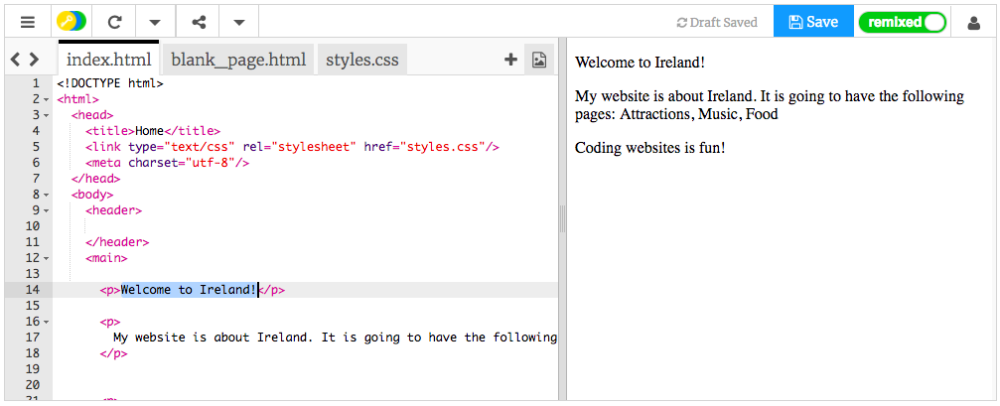
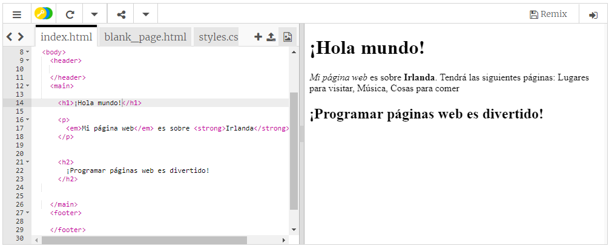

## ¡Tu primera página web!

- En el panel de la izquierda, en el **panel de códigos**, haz clic en la pestaña que pone `index.html`.

- Encuentra la línea que dice ` ¡Bienvenido a Irlanda! ` y cámbialo por tu propio mensaje - ten cuidado de ** no ** eliminar las etiquetas `<p>` al comienzo de la línea y `</p>` al final de la línea. Deberías poder ver tu página web actualizada en el panel de la derecha.



- Ahora en la misma línea, cambia `<p>` y ` </p>` por `<h1>` y ` </h1>` . ¿Has notado algún cambio en el resultado de la derecha?

```html
  <h1> ¡Bienvenido a Irlanda! </h1>
```

## \--- collapse \---

## title: explicación de HTML y etiquetas

**HTML** es el código para crear una página web.

El `.html` en el nombre del archivo le dice al navegador que el archivo es una página web, por lo que el navegador sabe buscar **etiquetas** que le digan qué mostrar. (Un navegador es el programa que utilizas para ver sitios web, como por ejemplo, Chrome o Firefox)

Las etiquetas HTML como `<p>` y ` </p>` definen diferentes partes de una página, por ejemplo, párrafos, encabezados o el cuerpo. Las piezas se llaman **elementos**. Piensa en ellos como si fueran bloques de construcción.

### ¿Por qué necesito dos etiquetas?

Necesitas una etiqueta de **apertura** y **cierre** para indicarle al navegador dónde **comienzan** y **terminan** los elementos. Entonces, para un párrafo, la etiqueta de apertura `<p>` dice "Aquí viene un texto que quiero que muestres como un párrafo". La etiqueta de cierre `</p>` le dice al navegador dónde termina el párrafo.

Todo lo que se encuentre entre las etiquetas `<body>` y ` </body>` es tu página web.

- Fíjate cómo la etiqueta de cierre **siempre** tiene una barra inclinada `/`.

\--- /collapse \---

- Intenta cambiar los números en sus **etiquetas de encabezado** para ver los diferentes tamaños que te dan. Pueden ir desde `<h1>` hasta `<h6>`. Recuerda cambiar tanto la etiqueta de apertura como la de cierre para que coincidan.

- Encuentra el código para el párrafo que dice `Mi sitio web es sobre Irlanda.` y cámbialo para que se vea así:

```html
  <p>
    <em>Mi sitio web</em> es sobre <strong>Irlanda</strong>. 
    Tendrá las siguientes páginas: Lugares para visitar, Música, Cosas para comer
  </p>
```

¿Puedes averiguar qué hacen las etiquetas `<em> </em>` y `<strong> </strong>`?



\--- challenge \---

## Desafío: agrega más texto propio

- Intenta añadir un nuevo párrafo o encabezado a tu página usando algunas de las etiquetas sobre las que has aprendido.

\--- hints \---

\--- hint \--- Cuando desees colocar texto en una página, deberás colocarlo entre dos etiquetas que le indiquen a tu navegador cómo mostrar tu texto. Por ejemplo, las etiquetas `<p> </p>` dicen al navegador que lo que esté entre ellas es un nuevo párrafo de texto, y las etiquetas `<h1> </h1>` dicen que el texto intermedio es un encabezado.

\--- /hint \---

\--- hint \---

El código para los párrafos sería así:

```html
  <p> Este es un párrafo de texto. </p>

  <p> Este es otro párrafo.
  Todo entre un conjunto de etiquetas p se muestra 
  junto en una línea larga en la página web. </p>
```

\--- /hint \---

\--- hint \---

El código para los títulos se ve así:

```html
  <h1>Este es un encabezado.</h1>
```

Los encabezados normalmente se mostrarán más grandes o más destacados que los párrafos.

\--- /hint \---

\--- /hints \---

\--- /challenge \---

¡Felicitaciones, has creado tu primera página web! En la siguientes páginas, descubrirás cómo controlar cómo se ve.