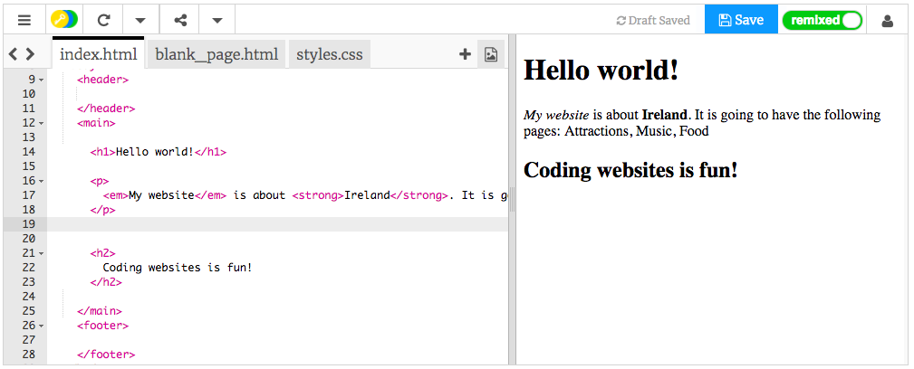

## Tu primera página web!

- En el panel de la izquierda, el panel de códigos ****, haga clic en la pestaña que dice `index.html`.

- Encuentra la línea que dice `Bienvenido a Irlanda!` y cámbielo a su propio mensaje: tenga cuidado **no** para eliminar las etiquetas`<p>` al comienzo de la línea y `</p>` al final de la línea. Debería ver la actualización de su página web en el panel de la derecha.


- Ahora en la misma línea, cambie `<p>` y `</p>` a `<h1>` y `</h1>`. ¿Notan algún cambio en el resultado a la derecha?

```html
  <h1>Bienvenido a Irlanda!</h1>
```

## \--- colapso \---

## título: HTML y etiquetas explicadas

**HTML** es el código que crea una página web.

El `.html` en el nombre del archivo le dice al navegador que el archivo es una página web, por lo que el navegador sabe buscar **etiquetas** y le dice qué mostrar. (Un navegador es el programa que usa para mirar sitios web, por ejemplo, Chrome o Firefox).

Las etiquetas HTML como `<p>` y `</p>` definen diferentes partes de una página, por ejemplo, párrafos, encabezados o el cuerpo. Las piezas se llaman **elementos**. Piense en ellos como bloques de construcción.

### ¿Por qué necesito dos etiquetas?

Es necesario un **abertura** y **de cierre** etiqueta para indicar al navegador donde los elementos **comienzan** y **finales**. Entonces, para un párrafo, la etiqueta de apertura `<p>` dice "Aquí viene un texto que quiero que se muestre como un párrafo". La etiqueta de cierre `</p>` le dice al navegador dónde termina el párrafo.

Todo entre las etiquetas `<body>` y `</body>` es su página web.

- Observe cómo la etiqueta de cierre **siempre** tiene una barra inclinada `/`.

\--- /colapso \---

- Intente cambiar los números en sus etiquetas de **encabezado** para ver los diferentes tamaños que le dan. Pueden ir desde `<h1>` hasta `<h6>`. Recuerde cambiar las etiquetas de apertura y cierre para que coincidan.

- Busque el código del párrafo que dice `Mi sitio web trata de Irlanda.` y cámbialo para que se vea así:

```html
  <p>
    <em>Mi sitio web</em> es aproximadamente <strong>Irlanda</strong>. 
    Tendrá las siguientes páginas: Atracciones, Música, Comida
  </p>
```

¿Puedes averiguar qué hacen las etiquetas `<em> </em>` y `<strong> </strong>`?



\--- desafío \---

## Desafío: agregue un poco más de texto propio

- Intente agregar un nuevo párrafo o encabezado a su página usando algunas de las etiquetas que ha aprendido.

\--- consejos \---

\--- sugerencia \--- Cuando quiere poner texto en una página, debe colocarlo entre dos etiquetas que le dicen a su navegador cómo mostrar su texto. Por ejemplo, las etiquetas `<p> </p>` dicen al navegador que lo que está entre ellas es un nuevo párrafo de texto, y las etiquetas `<h1> </h1>` indican que el texto entre ellas es un encabezado.

\--- /insinuación \---

\--- insinuación \---

El código para los párrafos se ve así:

```html
  <p>Este es un párrafo de texto.</p>

  <p>Este es otro párrafo.
  Todo lo que se encuentra entre un conjunto de etiquetas p se muestra en una línea larga en la página web.</p>
```

\--- /insinuación \---

\--- insinuación \---

El código para los encabezados se ve así:

```html
  <h1>Este es un encabezado.</h1>
```

Los títulos normalmente se mostrarán más grandes o más audaces que los párrafos.

\--- /insinuación \---

\--- / consejos \---

\--- / desafío \---

¡Felicitaciones, construiste tu primera página web! En la siguiente tarjeta, descubrirá cómo controlar cómo se ve.