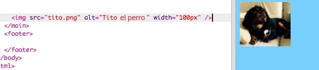
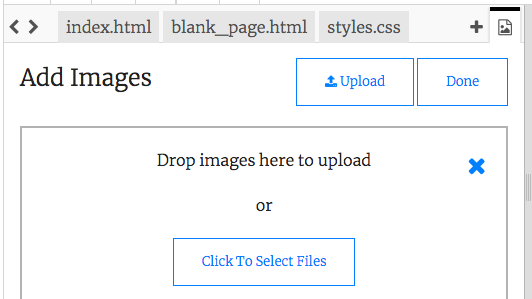

## Añadiendo imágenes

¡Agreguemos una foto!

- Ve a la pestaña llamada `index.html`. Busca la etiqueta `</main>` y escribe lo siguiente **encima**: 

```html
    
```

Así es como debería verse el resultado:



Ten en cuenta que esta etiqueta tiene elementos adicionales de información dentro de ella. Se llaman **atributos**.

- Encuentra el elemento de código que dice `ancho = "100px"` e intenta experimentar con diferentes números para ver si puedes descubrir qué hace este atributo. ¡No borres las letras `px`!

## \--- collapse \---

## title: Cómo funciona la etiqueta `img`

Ten en cuenta que la etiqueta `` es diferente de las otras etiquetas que has utilizado hasta ahora: no hay etiqueta `</img>`. En cambio, esta etiqueta **se cierra automáticamente **: tiene `/>` al final. Esto se debe a que no hay un "inicio" y un "final" para un elemento de imagen como el que hay para el texto en la página.

La etiqueta contiene **atributos** con información adicional:

- El atributo `src` le dice al navegador qué archivo usar para la imagen. 
- El atributo `alt` es una breve descripción que el navegador mostrará si no puede mostrar la imagen. 'alt' es la abreviatura de 'alternativa'. Este texto también ayuda a las personas que usan un lector de pantalla a saber cuál es la imagen.
- El atributo `width` le dice al navegador como de grande debe hacer la imagen. `100px` significa cien **píxeles**, que son los pequeños puntos que forman lo que estás viendo en tu pantalla. Si no incluyes este atributo, la imagen se mostrará en su tamaño original.

\--- /collapse \---

Ahora que conoces el código para poner una imagen en tu página web, probablemente desees cambiar la imagen, ¿verdad?

- ¡Lo primero que necesitarás es, por supuesto, una imagen! Puedes usar una que ya tienes en tu ordenador, como una fotografía que tomaste, o puedes obtenerla a través de Internet.

[[[generic-get-picture-from-web]]]

**Nota:** no todas las imágenes que encontrarás en Internet son gratuitas para que cualquiera las use. Si descargas una imagen, debes asegurarte de que sea una que puedas usar. Obten más información sobre esto aquí:

[[[images-permissions-to-use]]]

Una vez que tengas una foto, puedes **subir** el archivo a Trinket:

- En Trinket, haz clic en el icono **imagen** lado del signo **+**. 


Aquí es donde puedes ver las fotos que puedes usar en tu sitio web. Deberías ver la foto de Tito, el perro de CoderDojo.

- Haga clic en el botón **Agregar imagen** y luego haga clic en **Cargar**.

- Haz clic en el botón **Haga clic para seleccionar los archivos**. Busca y haz doble clic en tu archivo de imagen en la ventana que se abre.

- Haz clic en **Listo**.



Tu imagen se cargará y debería estar lista para usarse.

- Ve al archivo `index.html` y encuentra la etiqueta ``. Cambia el texto `tito.png` para que coincida exactamente con el nombre del archivo de imagen que hayas elegido. ¡Ten en cuenta que su nombre puede terminar en `.jpg` en lugar de `.png`!

El texto que acabas de cambiar es el atributo llamado `src`, que le dice al navegador qué archivo debe mostrar.

**Nota:** ¡El valor que escribas para un atributo debe estar entre comillas `""`!

\--- challenge \---

## Desafío: cambia el texto alternativo de la imagen

- Encuentra el atributo `alt` de tu elemento de imagen y cambia el texto por una breve descripción de tu fotografía. 

\--- /challenge \---