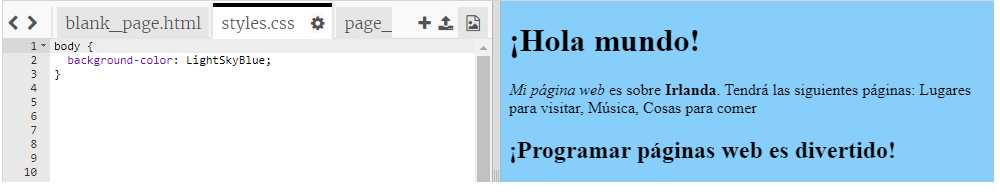
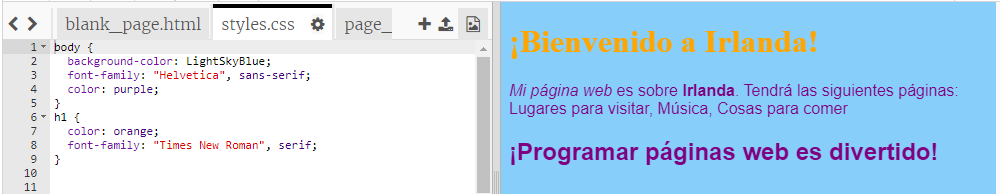

## Controlando cómo se ve

El código que describe cómo se ve un sitio web se llama **CSS**.

- Mire las pestañas en la parte superior del panel de códigos y vaya al archivo `styles.css` haciendo clic en la pestaña con ese nombre. El archivo contiene el siguiente texto:

```css
  cuerpo {color de fondo: blanco; }
```

- Cambie el color `blanco` por `LightSkyBlue` y vea qué sucede. ¡Tu sitio web ahora debería tener un fondo azul! 



## \--- colapso \---

## título: ¿Cómo funciona?

Si miras en la parte superior del archivo `index.html` , verás la siguiente línea:

```html
  <link type="text/css" rel="stylesheet" href="styles.css"/>
```

La línea de arriba le dice al buscador que busque un archivo especial llamado `styles.css`. Este archivo especial se llama hoja de estilo ****. Puede reconocer un archivo de hoja de estilo por `.css` en su nombre.

Una hoja de estilo contiene **reglas** para el aspecto que debe tener cada elemento de su página web.

Las llaves `{ }` y el código entre ellas son un conjunto de **reglas CSS**. La palabra `cuerpo` significa que las reglas son para todos los elementos `<body>` en su sitio web. Llamamos a la broca frente a las llaves un selector ****. Entonces, en este caso, es el selector para los elementos del cuerpo.

Cada regla dentro de las llaves está compuesta de:

- Una **propiedad** a la izquierda, seguida de un signo de `puntos <code> :`
- Un **valor** para la propiedad en el lado derecho después de los dos puntos
- Un símbolo de punto y coma `;` al final

\--- /colapso \---

- Vamos a agregar reglas para cambiar el aspecto del texto. Agregue dos líneas nuevas dentro de las llaves:

```css
  cuerpo {color de fondo: LightSkyBlue; font-family: "Helvetica", sans-serif; color morado; }
```

Mira cómo esto ha cambiado la página web.

La propiedad `color` es siempre para texto. Aquí, está configurando el color de todo el texto en el `cuerpo` de su página web.

- También puede escribir reglas separadas para los títulos y los párrafos. Para los encabezados `<h1>` , usa el selector `h1`. Debajo de la llave de cierre que contiene la regla de CSS para el cuerpo, agregue el siguiente código.

```css
  h1 {color: naranja; familia de fuentes: "Times New Roman", serif; }
```

El texto de encabezado debe ser naranja ahora, con el párrafo en morado como antes.



¿Te das cuenta de que las letras también se ven diferentes y tienen un color diferente? Esto se debe a que cambió su familia de fuentes ****. Puedes encontrar más fuentes [aquí](http://dojo.soy/web-font-families).

- Intente agregar un conjunto de reglas para los títulos `<h2>` , usando el selector `h2`.

- ¿Por qué no experimentar con diferentes combinaciones de colores para el texto y el fondo? Hay muchos colores disponibles para usar. Encuentre una lista completa de ellos [aquí](http://dojo.soy/web-color-names).