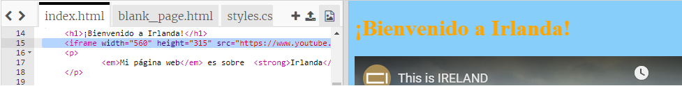
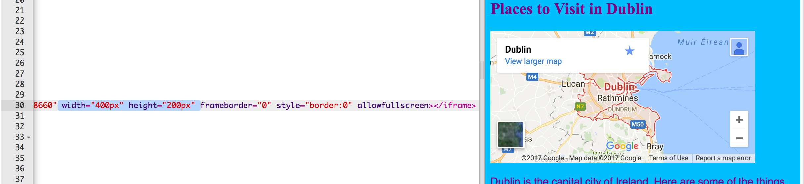

## Añadiendo un mapa o vídeo

YouTube te proporciona una manera fácil de añadir sus vídeos a tu sitio web. Agregar elementos de otras fuentes en línea a tu sitio web también se denomina **incrustación**.(embedding).

- Encuentra un video en YouTube que quieras mostrar en tu página web.

- Haz clic en el botón **Compartir** debajo del vídeo. Seleccione la opción **Insertar**.

Verás un cuadro de texto con todo el texto seleccionado. Si accidentalmente deseleccionas el texto, puedes volver a seleccionarlo haciendo clic en él y presionando las teclas <kbd>Ctrl</kbd> (o <kbd>cmd</kbd> en una Mac) y <kbd>A</kbd> al mismo tiempo.

- Presiona las teclas <kbd>Ctrl</kbd> (o <kbd>cmd</kbd> en una Mac) y <kbd>C</kbd> juntas para copiar el texto.

- Luego regresa al código HTML de tu sitio web y haz clic en el lugar donde deseas colocar el vídeo, por ejemplo debajo de un encabezado o párrafo. **Pega** el código presionando <kbd>Ctrl</kbd> (o <kbd>cmd</kbd> en una Mac) y <kbd>V</kbd> en tu teclado al mismo tiempo. ¡No te preocupes por entender todo el código que acabas de pegar!

Deberías ver el vídeo en tu página web.

La misma técnica también funciona para los mapas de Google. ¡Dale una oportunidad!

- Ve [aquí](http://dojo.soy/google-maps) y busca el lugar que deseas mostrar en tu página web. **Nota: **¡**NO** compartas información personal como la dirección de tu casa en una página web!

- Haz clic en el resultado, luego haz clic en el botón **Compartir**, copia el código y agrégualo a tu sitio web como se indicó anteriormente. 

- Si observas detenidamente, deberías encontrar **los atributos** `width` y `height` en el código pegado. Puedes cambiar sus valores para hacer que el mapa parezca más grande o más pequeño.

