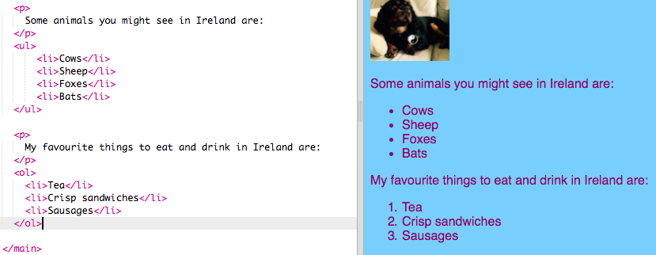

## Haciendo una lista

Ahora aprenderás cómo convertir una lista de elementos, como "unicornios, robots, gatos", en una lista más bonita con la que, mas adelante, puedas hacer cosas interesantes.

- En el archivo `index.html`, agrega el siguiente código justo encima de la línea con `</main>` en él:

```html
    <ul>
        <li>Vacas</li>
        <li>Ovejas</li>
        <li>Zorros</li>
        <li>Murciélagos</li>
    </ul>
```

El resultado debería ser una buena lista como esta:


Observa que hay un par separado de etiquetas `<li> </li>` alrededor de cada elemento de la lista.

Esta es una lista de algunos animales que puedes ver en Irlanda. Puedes cambiar los elementos de la lista a cosas que tengan sentido para tu página web y agregar un párrafo sobre la lista para describir de qué se trata ¡si lo deseas!

¿Qué tal si quisieras una lista numerada? Es casi lo mismo, pero en lugar de `<ul>`, usa `<ol>`. Una lista numerada también se denomina lista **ordenada**.

- Agrega el siguiente código debajo del código que acabas de escribir: ¡asegúrate de que sea **debajo de** la etiqueta `</ul>`!

```html
    <p>
        Mis cosas favoritas para comer y beber en Irlanda son:
    </p>
    <ol>
        <li>Té</li>
        <li>Sándwiches crujientes</li>
        <li>Salchichas</li>
    </ol>
```

Esto es lo que debería verse ahora:



\--- challenge \---

## Desafío: agregue estilo a tus listas

- Mira si puede agregar **reglas CSS** a tu hoja de estilo para cambiar el aspecto de tus listas.

\--- /challenge \---