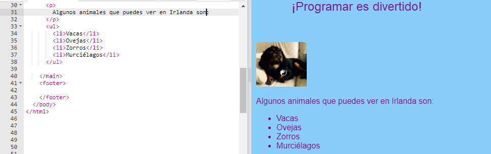
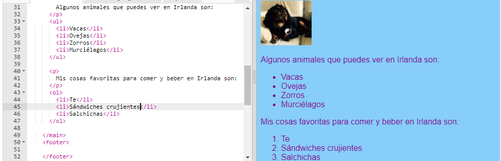

## Haciendo una lista

Ahora aprenderá a convertir una lista de elementos, como "unicornios, robots, gatos", en una lista de aspecto más agradable con la que puede hacer cosas interesantes más adelante.

- En el archivo `index.html` , agregue el siguiente código justo encima de la línea con `</main>` en él:

```html
    <ul>
        <li>Vacas</li>
        <li>Ovejas</li>
        <li>Zorros</li>
        <li>Murciélagos</li>
    </ul>
```

El resultado debería ser una buena lista como esta:



Observe que hay un par separado de `<li> </li>` etiquetas alrededor de cada elemento de la lista.

Esta es una lista de algunos animales que puedes ver en Irlanda. Puede cambiar los elementos de la lista por cosas que tengan sentido para su sitio web y agregar un párrafo encima de la lista para describir de qué se trata, si lo desea.

¿Qué tal si quisieras una lista numerada? Es casi lo mismo, pero en lugar de `<ul>`, usa `<ol>`. Una lista numerada también se llama lista **ordenada**.

- Agregue el siguiente código debajo del código que acaba de escribir: ¡asegúrese de que esté **debajo de** la etiqueta `</ul>`!

```html
    <p>
        Mis cosas favoritas para comer y beber en Irlanda son:
    </p>
    <ol>
        <li>Té</li>
        <li>Sándwiches crujientes</li>
        <li>Salchichas</li>
    </ol>
```

Esto es lo que debería ser ahora:



\--- desafío \---

## Desafío: agrega estilo a tus listas

- Vea si puede agregar **reglas de CSS** a su hoja de estilo para cambiar el aspecto de sus listas.

\--- / desafío \---