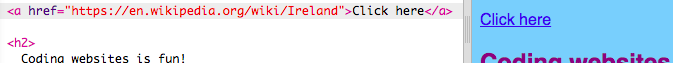

## Crear enlaces

En esta tarjeta aprenderás cómo hacer un enlace que te lleve a otra página cuando se hace clic.

- Agrega el siguiente código a la sección body de `index.html`:

```html
  <a href="">Haga clic aquí</a>
```

Las etiquetas `<a> </a>` convierten lo que se encuentre entre ellas en un enlace.

- Intenta hacer clic en tu enlace para ver qué sucede. No hace nada, ¿verdad?

Esto se debe a que el atributo `href` está vacío en este momento. Debe contener la **URL** (dirección web) de la página a la que deseas vincularla.

- Ve a la Wikipedia y encuentra una página sobre algo de tu sitio web. Voy a usar la página sobre Irlanda.

- Click in the address bar and select all of the text in it. Esa es la URL completa de la página en la que estás. Presiona las teclas <kdb>Ctrl</kdb> (o <kdb>cmd</kdb>) y <kdb>C</kdb> al mismo tiempo para copiarlo.
    
    

- En trinket, haz clic entre las comillas de después de `href =` y presiona las teclas <kdb>Ctrl</kdb> (o <kdb>cmd</kdb>) y <kdb>V</kdb> al mismo tiempo para pegar la URL que acabas de copiar. Su código debería verse así ahora:

```html
  <a href="https://en.wikipedia.org/wiki/Ireland">Haga clic aquí</a>
```

¡Acabas de crear tu primer enlace! Ahora haz clic para ver si funciona.



## \--- collapse \---

## title: Enlaces a otros sitios web

Trinket tiene problemas con algunas direcciones web. Si lo deseas, puedes probar las URL de sitios web que no sean Wikipedia, pero es posible que no funcionen en trinket. Sin embargo, si descargaras tu proyecto y vieras los archivos en un navegador web, verías que los enlaces funcionaban.

\--- /collapse \---

- Intenta poner una imagen entre las etiquetas `<a> </a>` en lugar de las palabras `Haga clic aquí`, tal que así:

```html
  <a href="https://en.wikipedia.org/wiki/Ireland">
      
  </a>
```

- Haz clic en tu foto. ¿Ves que se convirtió en un enlace?

También puedes poner un enlace en otros elementos de tu página web, como en un párrafo o incluso en una lista. Aquí hay un ejemplo de una frase con un enlace:

```html
  <p>
    <a href="https://en.wikipedia.org/wiki/Ireland">¡Haga clic aquí</a> para leer la página de Wikipedia!
  </p>
```

\--- challenge \---

## Desafío: poner un enlace en una lista

- Mira si puedes hacer una lista que contenga un enlace dentro de uno de los elementos de la lista.

\--- /challenge \---