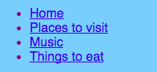

## Añadiendo más páginas

Esta tarjeta te mostrará cómo agregar más páginas a tu sitio web.

- En la parte superior del panel de códigos, haz clic en el símbolo **+** junto a las pestañas y escribe un nombre para tu nuevo archivo. Debe terminar en `.html` (¡incluido el punto!) Para que el navegador sepa que es una página web.


## \--- collapse \---

## title: Cambiar el nombre o eliminar un archivo

Si deseas cambiar el nombre de un archivo, haz clic en el icono del **engranaje** a la derecha del nombre del archivo y luego haga clic en el icono **lápiz**. Escribe el nuevo nombre y presiona **Enter**. También puedes eliminar un archivo haciendo clic en el icono de la **papelera** en lugar del icono del **lápiz**. 

Tal vez te preguntes por qué no puedes cambiar el nombre del archivo `index.html`. `index.html` es un nombre especial utilizado para la **página de inicio** de un sitio web. Esa es la primera página en la que aterrizas cuando visitas un página web. Cada vez que vas a la página de inicio de un sitio web, el navegador busca el archivo llamado `index.html` y lo muestra en tu pantalla.

\--- /collapse \---

- Busca el archivo `blank_page.html` y copia y pega todo el código de él en tu nuevo archivo. Como quieres copiarlo todo, puedes hacer clic en cualquier parte del código y usar el método abreviado de teclado <kbd>Ctrl</kbd> (o <kbd>cmd</kbd>) y <kbd>A</kbd> para seleccionarlo todo de una vez.

- Cambia el texto entre las etiquetas `<title> </title>` para que tu nueva página tenga un título adecuado. Trinket no mostrará el título, pero puedes verlo en la parte superior de la ventana de tu navegador si descargas tu proyecto.


- Entre las etiquetas `<main> </main>` en el nuevo archivo, usa las etiquetas que has aprendido para agregar cosas a la página, como ¡párrafos, encabezados, imágenes y listas!

- Repite los pasos anteriores para cada nueva página que desees agregar.

Cuando hay demasiadas pestañas para que Trinket las muestre a la vez, puedes usar los iconos **<** y **>** en la esquina superior izquierda de las pestañas para desplazarte entre ellas.


¡Ahora necesitas crear enlaces para poder acceder a cada una de tus nuevas páginas! Pongamos todos los enlaces en una lista.

- En el archivo `index.html`, agrega el siguiente código al cuerpo (body) de tu página web:

```html
    <ul>
        <li><a href="index.html">Inicio</a></li>
        <li><a href="attractions.html">Lugares para visitar</a></li>
        <li><a href="music.html">Música</a></li>
        <li><a href="food.html">Cosas para comer</a></li>
    </ul>
```

- Cambia el valor del atributo `href` para cada enlace (recuerda, es el texto dentro de las comillas) para que coincida exactamente con el nombre de cada archivo HTML que hayas creado.

- Cambia el texto entre las etiquetas `<a> </a>` por descripciones adecuadas de tus páginas.

¡Ahora puedes navegar por tus nuevas páginas!

